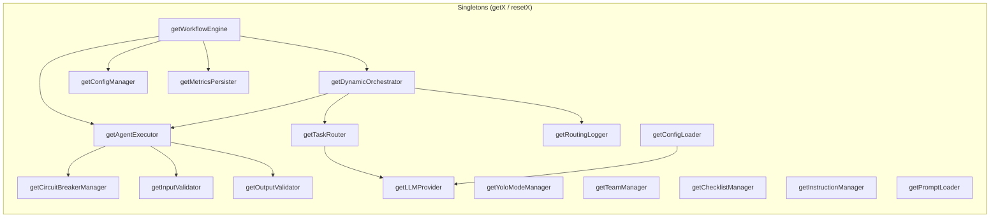
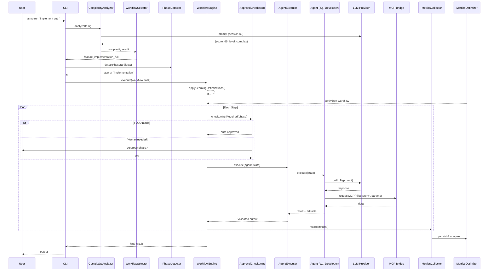

# ASMO Architecture / Архитектура системы

## Логические блоки

```
┌─────────────────────────────────────────────────────────────────────────────────┐
│                            CLI Layer (packages/cli)                              │
│                                                                                 │
│  asmo run ─── asmo suggest ─── asmo analyze ─── asmo workflow ─── asmo task     │
│       │              │               │                │               │          │
│       ▼              ▼               ▼                ▼               ▼          │
│  RunCommand    SuggestCommand   AnalyzeCommand   WorkflowCmd     TaskCommand    │
└──────┬──────────────┬───────────────┬────────────────┬───────────────┬───────────┘
       │              │               │                │               │
       ▼              ▼               ▼                ▼               ▼
┌─────────────────────────────────────────────────────────────────────────────────┐
│                        Orchestration Layer (packages/core)                       │
│                                                                                 │
│  ┌──────────────────────────────────────────────────────────────────────────┐   │
│  │                    A. Task Analysis & Routing                            │   │
│  │                                                                          │   │
│  │  ComplexityAnalyzer ──▶ WorkflowSelector ──▶ TaskRouter                  │   │
│  │        │                      │                    │                      │   │
│  │        ▼                      ▼                    ▼                      │   │
│  │  score: 0-100          selects 1 of 34      SkillMatcher                 │   │
│  │  level: trivial→       workflows             │ extractSkills (LLM)       │   │
│  │         enterprise                            │ detectPatterns            │   │
│  │                                               │ matchAgents              │   │
│  │                                               ▼                          │   │
│  │                                          AgentRegistry                   │   │
│  │                                          (28 agents indexed              │   │
│  │                                           by id/skill/role)             │   │
│  └──────────────────────────────────────────────────────────────────────────┘   │
│                                                                                 │
│  ┌──────────────────────────────────────────────────────────────────────────┐   │
│  │                    B. Workflow Execution Engine                           │   │
│  │                                                                          │   │
│  │  WorkflowEngine ◄──── DynamicOrchestrator                                │   │
│  │       │                       │                                          │   │
│  │       ├── PhaseManager        ├── AgentExecutor                          │   │
│  │       │   (11 phases)         │   ├── CircuitBreaker                     │   │
│  │       │                       │   ├── InputValidator                     │   │
│  │       ├── IterationManager    │   └── OutputValidator                    │   │
│  │       │   (retry + backoff)   │                                          │   │
│  │       │                       ├── RoutingLogger                          │   │
│  │       ├── ApprovalCheckpoint  │                                          │   │
│  │       │   ├── YOLO mode       └── ErrorCategorizer                       │   │
│  │       │   └── Human approval      (retryable vs fatal)                   │   │
│  │       │                                                                  │   │
│  │       ├── PrincipleValidators                                            │   │
│  │       │   ├── ZeroAmbiguity (Bob)                                        │   │
│  │       │   ├── BoringTechnology (Winston)                                 │   │
│  │       │   └── WhyFirst (John)                                            │   │
│  │       │                                                                  │   │
│  │       └── ContextCascade (phase → phase data flow)                       │   │
│  └──────────────────────────────────────────────────────────────────────────┘   │
│                                                                                 │
│  ┌──────────────────────────────────────────────────────────────────────────┐   │
│  │                    C. Multi-Agent Collaboration                           │   │
│  │                                                                          │   │
│  │  Sequential ─── PartySession ─── BrainstormingSession                    │   │
│  │  (default)      (parallel +      (4 rounds:                              │   │
│  │                  convergence)      propose → critique →                   │   │
│  │                                    synthesize → decide)                   │   │
│  │                                         │                                │   │
│  │                 AdversarialReview        ▼                                │   │
│  │                 (red team / blue)    ADR output                           │   │
│  └──────────────────────────────────────────────────────────────────────────┘   │
│                                                                                 │
│  ┌──────────────────────────────────────────────────────────────────────────┐   │
│  │                    D. Adaptive Phase Detection                            │   │
│  │                                                                          │   │
│  │  ContextAnalyzer ──▶ PhaseDetector (LLM) ──▶ recommended start phase     │   │
│  │  (scan artifacts:     confidence score         skip completed phases      │   │
│  │   code, tests, docs,  alternative phases       join mid-workflow)         │   │
│  │   git history)                                                            │   │
│  └──────────────────────────────────────────────────────────────────────────┘   │
│                                                                                 │
│  ┌──────────────────────────────────────────────────────────────────────────┐   │
│  │                    E. Metrics & Learning Loop                             │   │
│  │                                                                          │   │
│  │  MetricsCollector ──▶ MetricsPersister (SQLite)                           │   │
│  │       │                       │                                          │   │
│  │       ▼                       ▼                                          │   │
│  │  MetricsOptimizer ◄──── LearningLoop                                     │   │
│  │  (auto-optimizations:   (continuous                                      │   │
│  │   parallelize,           improvement)                                    │   │
│  │   remove redundant,         │                                            │   │
│  │   adjust timeouts)          ▼                                            │   │
│  │                      RetrospectiveAgent                                  │   │
│  │                      (post-mortem reports)                               │   │
│  └──────────────────────────────────────────────────────────────────────────┘   │
│                                                                                 │
│  ┌──────────────────────────────────────────────────────────────────────────┐   │
│  │                    F. Configuration & Templates                           │   │
│  │                                                                          │   │
│  │  ConfigManager ──── ConfigLoader ──── SkillMDLoader                      │   │
│  │  (3-tier:            (roles JSON,     (SKILL.md                          │   │
│  │   defaults →          skills MD,       Anthropic                         │   │
│  │   file →              workflows JSON)  Standard 2026)                    │   │
│  │   env vars)                │                                             │   │
│  │                            ▼                                             │   │
│  │  RoleManager ◄──── 22 role definitions                                   │   │
│  │  TeamManager ◄──── team templates                                        │   │
│  │  PromptLoader ◄─── 12 prompt .md files                                   │   │
│  │  ChecklistManager                                                        │   │
│  │  InstructionManager                                                      │   │
│  └──────────────────────────────────────────────────────────────────────────┘   │
└─────────────────────────────────────────────────────────────────────────────────┘

┌─────────────────────────────────────────────────────────────────────────────────┐
│                          Agent Layer (28 agents)                                │
│                                                                                 │
│  BaseAgent (abstract)                                                           │
│  ├── callLLM()          ├── requestMCP()         ├── createResult()             │
│  ├── callLLMForJSON()   ├── setRole()            └── createArtifact()           │
│  │                      │                                                       │
│  ├── Core (6)           ├── UI/UX (2)            ├── Quality (1)                │
│  │   Architect           │   UIDev                │   CodeReviewer               │
│  │   Developer           │   UXDesigner           │                              │
│  │   Tester              │                        ├── Coordination (4)           │
│  │   Debugger            ├── Business (3)         │   DesignValidator            │
│  │   DevOps              │   BusinessAnalyst      │   Merge                      │
│  │   Optimizer           │   ProjectManager       │   PostDeployMonitor          │
│  │                       │   ProductOwner         │   RequirementsValidator      │
│  ├── Specialized (5)     │                        │                              │
│  │   APIDesigner         ├── BMAD New (3)         ├── BMAD Integration (4)       │
│  │   DataArchitect       │   ProductManager       │   Analyst                    │
│  │   PerfEngineer        │   RFQSpecialist        │   TechWriter                 │
│  │   ScrumMaster         │   SupplierOps          │   TestArchitect              │
│  │   SecuritySpecialist  │                        │   AdversarialReviewer        │
│  │                       │                        │                              │
│  └───────────────────────┴────────────────────────┘                              │
└──────────────┬──────────────────────────────┬────────────────────────────────────┘
               │                              │
               ▼                              ▼
┌──────────────────────────────┐ ┌────────────────────────────────────────────────┐
│    LLM Provider Layer        │ │              MCP Bridge                         │
│                              │ │                                                 │
│  LLMProviderFactory          │ │  P0 (Critical):                                 │
│  ├─ SessionProvider ($0)     │ │    memory (knowledge graph)                     │
│  │  (claude -p via CLI)      │ │    supabase (database)                          │
│  │                           │ │    filesystem (file I/O)                        │
│  ├─ AnthropicProvider ($$)   │ │                                                 │
│  │  (Anthropic SDK + API key)│ │  P1 (Recommended):                              │
│  │                           │ │    context7 (library docs)                      │
│  └─ Auto-fallback:           │ │    github (GitKraken)                           │
│     Session → API → Heuristic│ │    playwright (browser)                         │
│                              │ │                                                 │
│  Models: opus, sonnet, haiku │ │  P2 (Optional):                                 │
│  Routing by complexity score │ │    render, vercel (deploy logs)                 │
└──────────────────────────────┘ └────────────────────────────────────────────────┘

┌─────────────────────────────────────────────────────────────────────────────────┐
│                     Persistence Layer                                            │
│                                                                                 │
│  MetricsPersister (SQLite)    TaskPersister (SQLite/JSON)    DocumentRegistry    │
│  ├── workflow_metrics         ├── task state                 ├── versioning      │
│  ├── agent_step_metrics       ├── task history               └── phase docs      │
│  └── bottleneck_data          └── parent-child links                             │
└─────────────────────────────────────────────────────────────────────────────────┘

┌─────────────────────────────────────────────────────────────────────────────────┐
│                     Template Store (packages/core/templates/)                    │
│                                                                                 │
│  roles/                 skills/                workflows/          teams/        │
│  ├── core-roles.json    ├── 92 SKILL.md        ├── 34 workflow    ├── team      │
│  ├── specialized-       │    files              │    JSON files    │   defs      │
│  │   roles.json         ├── skill-deps.json    │                  │             │
│  └── project-           └── (legacy .yaml)     │                  │             │
│      roles.json                                 │                  │             │
└─────────────────────────────────────────────────────────────────────────────────┘
```

---

## Mermaid: Основной поток выполнения

```mermaid
flowchart TB
    User["👤 User: asmo run 'task'"]

    subgraph CLI["CLI Layer"]
        RunCmd["RunCommand"]
        SuggestCmd["SuggestCommand"]
    end

    subgraph Analysis["A. Task Analysis & Routing"]
        CA["ComplexityAnalyzer<br/>score 0-100<br/>5 levels"]
        WS["WorkflowSelector<br/>34 workflows"]
        SM["SkillMatcher<br/>LLM skill extraction<br/>pattern detection"]
        TR["TaskRouter"]
        AR["AgentRegistry<br/>28 agents"]
    end

    subgraph Execution["B. Workflow Execution"]
        WE["WorkflowEngine"]
        DO["DynamicOrchestrator"]
        PM["PhaseManager<br/>11 phases"]
        IM["IterationManager<br/>retry + backoff"]
        AC["ApprovalCheckpoint"]
        YM["YoloModeManager"]
        AE["AgentExecutor"]
        CB["CircuitBreaker"]
        EC["ErrorCategorizer"]
        PV["PrincipleValidators<br/>Bob / Winston / John"]
        CC["ContextCascade"]
    end

    subgraph Collab["C. Multi-Agent Collaboration"]
        SEQ["Sequential"]
        PS["PartySession<br/>parallel + merge"]
        BS["BrainstormingSession<br/>4 rounds → ADR"]
        ADV["AdversarialReview"]
    end

    subgraph Adaptive["D. Adaptive Phase Detection"]
        CTX["ContextAnalyzer<br/>scan artifacts"]
        PD["PhaseDetector<br/>LLM-based"]
    end

    subgraph Learning["E. Metrics & Learning"]
        MC["MetricsCollector"]
        MP["MetricsPersister<br/>SQLite"]
        MO["MetricsOptimizer"]
        LL["LearningLoop"]
        RA["RetrospectiveAgent"]
    end

    subgraph Config["F. Configuration"]
        CM["ConfigManager<br/>3-tier cascade"]
        CL["ConfigLoader<br/>roles/skills/workflows"]
        RM["RoleManager<br/>22 roles"]
        PL["PromptLoader<br/>12 prompts"]
        SML["SkillMDLoader"]
    end

    subgraph Agents["Agent Layer"]
        BA["BaseAgent"]
        A1["Architect"]
        A2["Developer"]
        A3["Tester"]
        A4["Debugger"]
        A5["DevOps"]
        A6["...23 more"]
    end

    subgraph LLM["LLM Provider"]
        LPF["LLMProviderFactory"]
        SP["SessionProvider<br/>$0 via claude CLI"]
        AP["AnthropicProvider<br/>$$ via API key"]
    end

    subgraph MCP["MCP Bridge"]
        MB["mcpBridge.callMCP()"]
        M1["memory"]
        M2["supabase"]
        M3["filesystem"]
        M4["github"]
        M5["playwright"]
    end

    User --> RunCmd
    User -.-> SuggestCmd
    RunCmd --> CA
    CA -->|score + level| WS
    WS -->|workflow| WE
    CA --> SM
    SM --> AR
    SM --> TR

    CTX --> PD
    PD -->|start phase| WE

    WE --> PM
    WE --> IM
    WE --> AC
    AC --> YM
    WE --> PV
    WE --> CC
    WE --> DO
    DO --> AE
    AE --> CB
    AE --> EC
    DO --> TR

    WE --> SEQ
    WE --> PS
    WE --> BS
    WE --> ADV

    AE --> BA
    BA --> A1
    BA --> A2
    BA --> A3
    BA --> A4
    BA --> A5
    BA --> A6

    BA --> LPF
    LPF --> SP
    LPF --> AP

    BA --> MB
    MB --> M1
    MB --> M2
    MB --> M3
    MB --> M4
    MB --> M5

    WE --> MC
    MC --> MP
    MP --> MO
    MP --> LL
    LL --> RA
    MO -->|optimize| WE

    CM --> CL
    CL --> RM
    CL --> SML
    CL --> PL
    CL -->|roles/skills| AR

    style CLI fill:#4a90d9,color:#fff
    style Analysis fill:#f5a623,color:#fff
    style Execution fill:#d0021b,color:#fff
    style Collab fill:#7ed321,color:#fff
    style Adaptive fill:#9013fe,color:#fff
    style Learning fill:#50e3c2,color:#000
    style Config fill:#b8e986,color:#000
    style Agents fill:#f8e71c,color:#000
    style LLM fill:#bd10e0,color:#fff
    style MCP fill:#4a4a4a,color:#fff
```



---

## Mermaid: Singleton Dependencies



---

## Mermaid: Data Flow — от задачи до результата



---

## Блоки системы (сводная таблица)

| # | Блок | Файлы | Ответственность |
|---|------|-------|-----------------|
| A | **Task Analysis & Routing** | ComplexityAnalyzer, WorkflowSelector, SkillMatcher, TaskRouter, AgentRegistry | Анализ сложности, выбор workflow, маршрутизация к агентам |
| B | **Workflow Execution** | WorkflowEngine, DynamicOrchestrator, PhaseManager, IterationManager, ApprovalCheckpoint, AgentExecutor, CircuitBreaker, ErrorCategorizer, PrincipleValidators, ContextCascade | Исполнение workflow: фазы, ретраи, аппрувы, валидация |
| C | **Multi-Agent Collaboration** | PartySession, BrainstormingSession, AdversarialReview, ElicitationManager | Параллельная работа агентов, брейнштормы, adversarial review |
| D | **Adaptive Phase Detection** | ContextAnalyzer, PhaseDetector | Сканирование артефактов, LLM-определение стартовой фазы |
| E | **Metrics & Learning** | MetricsCollector, MetricsPersister, MetricsOptimizer, LearningLoop, RetrospectiveAgent | Сбор метрик, SQLite persistence, авто-оптимизация workflow |
| F | **Configuration** | ConfigManager, ConfigLoader, RoleManager, SkillMDLoader, PromptLoader, TeamManager, ChecklistManager, InstructionManager | 3-tier конфиг, 22 роли, 92 скилла, 34 workflow, 12 промптов |
| G | **Agent Layer** | BaseAgent + 28 специализированных агентов | Выполнение задач: LLM-вызовы, MCP-интеграция, артефакты |
| H | **LLM Provider** | LLMProviderFactory, SessionProvider, AnthropicProvider | Dual LLM: Session ($0) → API ($$) → Heuristics (fallback) |
| I | **MCP Bridge** | MCPBridge (8 серверов) | Интеграция с внешними инструментами: memory, fs, github, playwright |
| J | **Persistence** | MetricsPersister, TaskPersister, JsonTaskPersister, DocumentRegistry | SQLite/JSON хранение метрик, задач, документов |
| K | **Templates** | roles/*.json, skills/*.md, workflows/*.json, teams/*.json | Статические определения ролей, скиллов, workflow, команд |
| L | **CLI** | 5 команд: run, suggest, analyze, workflow, task | Пользовательский интерфейс |

---

## Ключевые архитектурные решения

1. **Dual LLM Strategy**: Session ($0) как primary, API как fallback — оптимизация стоимости
2. **Singleton Pattern**: 17+ синглтонов с `getX()`/`resetX()` для thread-safe доступа
3. **LLM-First Intelligence**: Анализ сложности, детекция фаз, матчинг скиллов — всё через LLM
4. **Adaptive Phase Joining**: Workflow можно начать с любой фазы на основе существующих артефактов
5. **YOLO Mode**: Автоматический bypass аппрувов для простых задач (score < 40)
6. **Learning Loop**: Метрики → SQLite → MetricsOptimizer → автоматическая оптимизация workflow
7. **CircuitBreaker**: Защита от каскадных отказов при выполнении агентов
8. **MCP Integration**: 8 серверов с приоритетами (P0/P1/P2) для доступа к внешним инструментам
9. **3-Tier Config**: defaults → config file → env vars — гибкая конфигурация
10. **Principle Validators**: 3 валидатора (Zero Ambiguity, Boring Technology, Why-First) — quality gates
