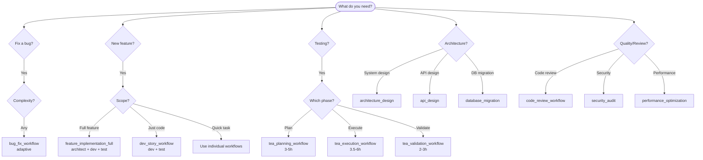

# Next Steps: Action Plan

**Date:** 2026-02-09
**Status:** Post-Phase 2
**Priority:** Immediate → Short-term → Long-term

---

## TL;DR

1. **Immediate:** Create git commit (30m)
2. **Short-term:** Add doc verification + decision tree (5h)
3. **Medium-term:** Start Phase 3 planning (1 week)

---

## Immediate Actions (Today) ⚡

### 1. Create Git Commit for Phase 2 ✅ RECOMMENDED
**Time:** 30m
**Priority:** HIGH
**Why:** Preserve all Phase 2 work, enable rollback if needed

**Action:**
```bash
git add .
git status  # Review changes

git commit -m "$(cat <<'EOF'
feat(phase-2): simplify workflows and sync documentation

- Remove MeetConnect agents (rfq-specialist, supplier-ops)
- Consolidate bug fix workflows (2 → 1 adaptive)
- Consolidate TEA workflows (8 → 3 adaptive)
- Remove meta-phase workflows (discovery, implementation)
- Update PRD and CLAUDE.md with accurate metrics
- Archive legacy workflows with migration guides

Metrics:
- Agents: 28 → 25 (-11%)
- Workflows: 35 → 27 (-23%)
- Documentation: 80% → 100% accuracy

BREAKING CHANGE: Removed workflows (migration guides in archive/)

See docs/phase-2-final-verification.md for complete details

Co-Authored-By: Claude Sonnet 4.5 <noreply@anthropic.com>
EOF
)"
```

**Decision:** Single commit or multiple commits per task?
- ✅ **Recommended:** Single commit (cohesive unit)
- ○ **Alternative:** 7 separate commits (more granular)

---

### 2. Optional: Create CHANGELOG.md ⭐ RECOMMENDED
**Time:** 15m
**Priority:** MEDIUM
**Why:** Users need to know what changed

**Action:**
```bash
cat > CHANGELOG.md <<'EOF'
# Changelog

## [1.1.0] - 2026-02-09

### Added
- Adaptive bug_fix_workflow with complexity-based skipping
- TEA consolidated workflows (tea-planning, tea-execution, tea-validation)
- Comprehensive documentation (20 new files, ~8000 lines)
- Migration guides for archived workflows

### Changed
- Consolidated bug fix workflows: 2 → 1 adaptive workflow
- Consolidated TEA workflows: 8 → 3 adaptive workflows
- Updated CLAUDE.md and PRD with accurate metrics (100% sync)

### Removed
- MeetConnect agents (rfq-specialist, supplier-ops)
- Meta-phase workflows (discovery_phase_full, implementation_phase_full)
- advanced_bug_fix workflow (merged into bug_fix_workflow)

### Migration
- TEA workflows: See `archive/tea-legacy/README.md`
- Meta-phase workflows: See `archive/meta-phase-legacy/README.md`
- Bug fix: Use `bug_fix_workflow` (now adaptive)

### BREAKING CHANGES
- Workflows tea-1 through tea-8 replaced with tea-planning/execution/validation
- Meta-phase workflows removed, use feature_implementation_full instead
- advanced_bug_fix removed, use bug_fix_workflow instead
EOF
```

---

## Short-Term Tasks (This Week) 📅

### 3. Add Automated Doc Verification ✅ HIGH PRIORITY
**Time:** 2h
**Priority:** HIGH
**Why:** Prevent documentation drift (current risk: medium)

**Implementation Plan:**

1. Create verification script (1h):
```typescript
// packages/cli/src/commands/verify-docs.ts
import { glob } from 'glob'
import { readFileSync } from 'fs'
import { join } from 'path'

export async function verifyDocs() {
  // Count actual resources
  const agents = glob.sync('packages/core/src/agents/roles/*.ts').length
  const workflows = glob.sync('packages/core/templates/workflows/**/!(*.checklist).json', {
    ignore: ['**/archive/**', '**/.backup*/**']
  }).length
  const coreRoles = JSON.parse(readFileSync('packages/core/templates/roles/core-roles.json', 'utf-8')).length
  const specRoles = JSON.parse(readFileSync('packages/core/templates/roles/specialized-roles.json', 'utf-8')).length
  const roles = coreRoles + specRoles

  // Read CLAUDE.md
  const claudeMd = readFileSync('CLAUDE.md', 'utf-8')
  const agentMatch = claudeMd.match(/\| Agents \| (\d+) \|/)
  const workflowMatch = claudeMd.match(/\| Workflows \| (\d+) \|/)
  const roleMatch = claudeMd.match(/\| Roles \| (\d+)/)

  // Verify
  const errors = []
  if (agentMatch && parseInt(agentMatch[1]) !== agents) {
    errors.push(`CLAUDE.md agents mismatch: ${agentMatch[1]} vs ${agents}`)
  }
  if (workflowMatch && parseInt(workflowMatch[1]) !== workflows) {
    errors.push(`CLAUDE.md workflows mismatch: ${workflowMatch[1]} vs ${workflows}`)
  }
  if (roleMatch && parseInt(roleMatch[1]) !== roles) {
    errors.push(`CLAUDE.md roles mismatch: ${roleMatch[1]} vs ${roles}`)
  }

  if (errors.length > 0) {
    console.error('❌ Documentation verification failed:')
    errors.forEach(e => console.error(`  - ${e}`))
    process.exit(1)
  }

  console.log('✅ Documentation verified')
  console.log(`  Agents: ${agents}`)
  console.log(`  Workflows: ${workflows}`)
  console.log(`  Roles: ${roles}`)
}
```

2. Add CLI command (30m):
```typescript
// packages/cli/src/index.ts
program
  .command('verify-docs')
  .description('Verify documentation matches codebase')
  .action(verifyDocs)
```

3. Add pre-commit hook (30m):
```bash
# .husky/pre-commit
#!/bin/sh
pnpm asmo verify-docs
```

**Success Criteria:**
- [ ] `asmo verify-docs` command works
- [ ] Detects mismatches accurately
- [ ] Exits with error code on failure
- [ ] Pre-commit hook installed

---

### 4. Create Workflow Decision Tree ⭐ RECOMMENDED
**Time:** 3h
**Priority:** MEDIUM
**Why:** Improve user experience (reduce workflow selection time)

**Implementation Plan:**

1. Create Mermaid diagram (1h):


2. Add to CLAUDE.md (30m)
3. Create interactive CLI (1h 30m):
```typescript
// asmo select-workflow (interactive)
? What do you need to do?
  > Fix a bug
    Add a new feature
    Testing (plan/execute/validate)
    Architecture design
    Code review/quality

? Bug complexity?
  > Simple (typo, config)
    Medium (logic error)
    Complex (race condition)

→ Recommended: bug_fix_workflow (adaptive)
  Run now? (Y/n)
```

**Success Criteria:**
- [ ] Mermaid diagram in docs
- [ ] Added to CLAUDE.md
- [ ] Interactive CLI works
- [ ] Reduces user questions

---

### 5. Optional: Review Validation Agents ○ LOW PRIORITY
**Time:** 1h
**Priority:** LOW (optional Task #11)
**Why:** Complete Phase 2, check for duplications

**Agents to review:**
- design-validator (4 KB)
- merge-coordinator (3 KB)
- post-deploy-monitor (5 KB)
- requirements-validator (6 KB)

**Questions:**
- Used in workflows? (check JSON files)
- Any duplication? (compare functionality)
- Could consolidate? (similar to code-reviewer?)

**Decision:** Skip for now or execute?

---

### 6. Add Integration Tests ⭐ RECOMMENDED
**Time:** 4h
**Priority:** MEDIUM
**Why:** Quality assurance, catch regressions

**Implementation Plan:**

1. Test adaptive bug_fix_workflow (1h):
```typescript
describe('bug_fix_workflow adaptive behavior', () => {
  it('skips architect and code-reviewer for simple bugs', async () => {
    const workflow = await loadWorkflow('bug_fix_workflow')
    const result = await simulateWorkflow(workflow, { complexity: 20 })

    expect(result.steps.length).toBe(3)
    expect(result.steps).not.toContain('architect')
    expect(result.steps).not.toContain('code-reviewer')
  })

  it('includes all steps for complex bugs', async () => {
    const workflow = await loadWorkflow('bug_fix_workflow')
    const result = await simulateWorkflow(workflow, { complexity: 75 })

    expect(result.steps.length).toBe(5)
    expect(result.steps).toContain('architect')
    expect(result.steps).toContain('code-reviewer')
  })
})
```

2. Test TEA workflows (2h):
```typescript
describe('TEA consolidated workflows', () => {
  it('tea-planning has correct deliverables', async () => {
    const workflow = await loadWorkflow('tea_planning_workflow')
    expect(workflow.deliverables).toHaveLength(16)
    expect(workflow.deliverables).toContain('test_strategy_document')
  })

  it('tea-execution skips framework_design for simple', async () => {
    const workflow = await loadWorkflow('tea_execution_workflow')
    const result = await simulateWorkflow(workflow, { complexity: 25 })

    expect(result.steps).not.toContain('framework_design')
  })
})
```

3. Test workflow loading (1h):
```typescript
describe('All workflows load successfully', () => {
  it('loads all 27 workflows without errors', async () => {
    const workflows = await loadAllWorkflows()
    expect(workflows).toHaveLength(27)
    workflows.forEach(wf => {
      expect(wf.id).toBeDefined()
      expect(wf.steps).toBeDefined()
      expect(wf.phases).toBeDefined()
    })
  })
})
```

**Success Criteria:**
- [ ] Tests for adaptive workflows
- [ ] Tests for TEA workflows
- [ ] Tests for workflow loading
- [ ] All tests pass

---

## Medium-Term Goals (Next Sprint) 🎯

### Week 1: Quality & Tooling
1. ✅ Complete doc verification (2h)
2. ✅ Create decision tree (3h)
3. ✅ Add integration tests (4h)
4. ○ Performance profiling (4h)

**Total:** ~13h

### Week 2: Phase 3 Planning
1. Define Phase 3 scope (2h)
2. Identify bottlenecks (3h)
3. Plan optimizations (2h)
4. Create task breakdown (2h)

**Total:** ~9h

---

## Long-Term Vision (Phases 3-5) 🚀

### Phase 3: Performance & Monitoring (2-3 weeks)
**Goals:**
- 20% faster workflow execution
- Real-time progress tracking
- Metrics dashboard
- Error analytics

**Tasks:**
- Profile ComplexityAnalyzer
- Cache workflow selections
- Add telemetry (opt-in)
- Build metrics dashboard

### Phase 4: Production Hardening (2-3 weeks)
**Goals:**
- Enterprise-ready reliability
- Advanced error handling
- Production monitoring

**Tasks:**
- Add retry mechanisms
- Implement circuit breakers
- Set up alerting
- Add graceful degradation

### Phase 5: Advanced Features (4-6 weeks)
**Goals:**
- Workflow composition
- Custom workflow builder
- Team collaboration

**Tasks:**
- Chain workflows
- Visual workflow builder
- Multi-user support
- Workflow marketplace

---

## Decision Points 🤔

### Immediate Decisions Needed

1. **Git commit strategy?**
   - ✅ Recommended: Single commit for Phase 2
   - ○ Alternative: Multiple commits (one per task)

2. **Create CHANGELOG?**
   - ✅ Recommended: Yes (15m, good practice)
   - ○ Alternative: Skip for now

3. **Task #11 (validation agents)?**
   - ○ Recommended: Skip for now (low priority)
   - ○ Alternative: Complete now (1h)

### Short-Term Decisions

4. **Add doc verification?**
   - ✅ **MUST DO** (prevents future drift)

5. **Create decision tree?**
   - ✅ Recommended: Yes (improves UX)
   - ○ Alternative: Defer to Phase 3

6. **Add integration tests?**
   - ✅ Recommended: Yes (quality assurance)
   - ○ Alternative: Defer to Phase 3

---

## Recommended Immediate Action Plan 📋

### Today (2-3 hours)
1. ✅ **Create git commit** (30m) - HIGH PRIORITY
2. ✅ **Create CHANGELOG.md** (15m) - RECOMMENDED
3. ✅ **Review & approve retrospective** (15m)

### This Week (8-10 hours)
4. ✅ **Add doc verification** (2h) - HIGH PRIORITY
5. ⭐ **Create decision tree** (3h) - RECOMMENDED
6. ⭐ **Add integration tests** (4h) - RECOMMENDED

### Next Week (9 hours)
7. ○ Start Phase 3 planning (2h)
8. ○ Identify performance bottlenecks (3h)
9. ○ Plan optimization strategy (2h)
10. ○ Create Phase 3 task breakdown (2h)

---

## Success Metrics 📊

### This Week
- [ ] Git commit created
- [ ] CHANGELOG.md added
- [ ] Doc verification working
- [ ] Decision tree created
- [ ] Integration tests passing

### This Sprint
- [ ] Phase 3 plan approved
- [ ] Performance baseline established
- [ ] Optimization targets set
- [ ] Task breakdown complete

---

## Questions for User ❓

1. **Git commit strategy:** Single commit or multiple commits?
2. **CHANGELOG:** Create now or skip?
3. **Task #11:** Review validation agents now or defer?
4. **Priority:** Doc verification → Decision tree → Tests? Or different order?
5. **Phase 3 start:** Next week or wait for feedback on Phase 2?

---

**Recommended First Action:**
```bash
# Create git commit for Phase 2
git add .
git commit -m "feat(phase-2): simplify workflows and sync documentation"
```

**Then:** Await user feedback on priorities

---

**Date:** 2026-02-09
**Status:** ✅ Ready for Next Steps
**Priority Order:** Git commit → Doc verification → Decision tree → Tests
