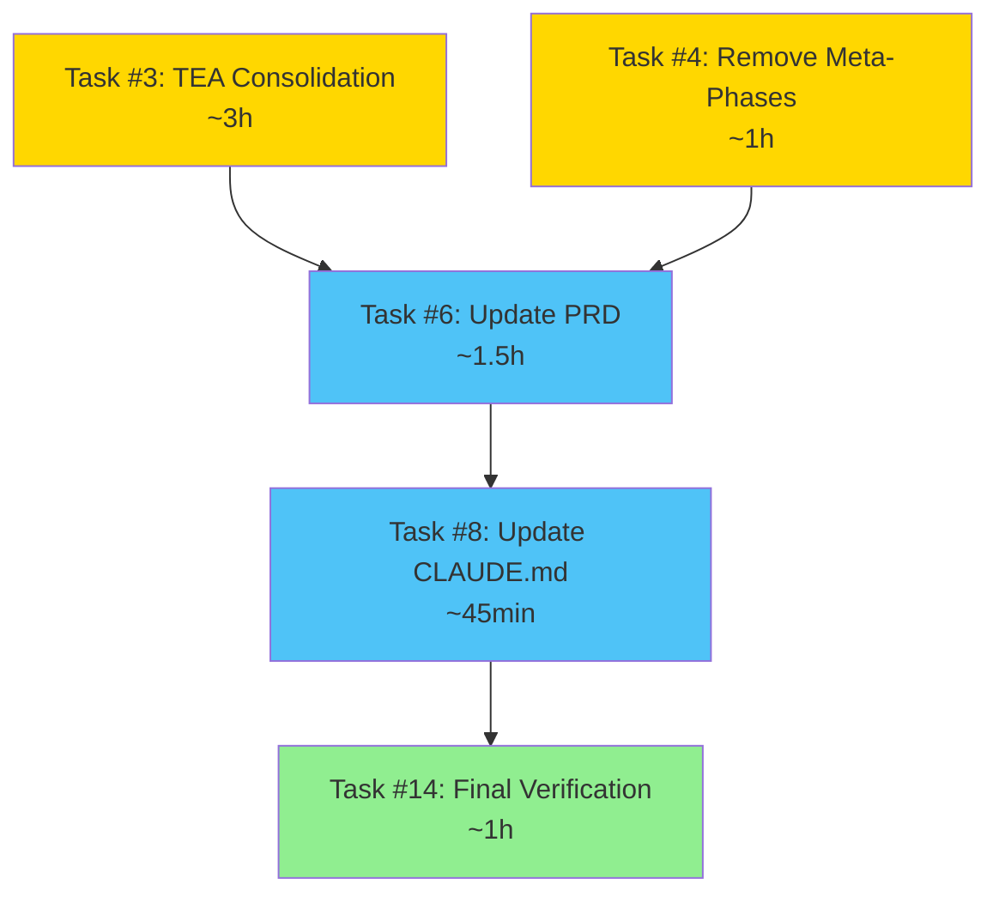

# Phase 2: Completion Plan

**Date:** 2026-02-09
**Status:** 🟡 **IN PROGRESS** (4/9 tasks done)
**Remaining:** 5 tasks
**Estimated Time:** 6-8 hours

---

## Executive Summary

**Completed (4/9):**
- ✅ Task #1: Remove MeetConnect
- ✅ Task #9: Document product-manager (reverted after review)
- ✅ Task #10: Check advanced_bug_fix
- ✅ Task #2: Consolidate bug fix workflows

**Remaining (5/9):**
- ⏭️ Task #3: Consolidate TEA workflows (8 → 2-3)
- ⏭️ Task #4: Remove meta-phase workflows
- ⏭️ Task #6: Update PRD
- ⏭️ Task #8: Update CLAUDE.md
- ⏭️ Task #14: Final verification

---

## Task Dependency Graph



**Critical Path:** T3 → T6 → T8 → T14 (6.25h)
**Parallel Path:** T4 → T6 (can start while T3 runs)

**Optimization:** Run T3 and T4 in parallel (saves ~1h)

---

## Execution Strategy

### Option 1: Sequential (Conservative)
```
T3 (3h) → T4 (1h) → T6 (1.5h) → T8 (45min) → T14 (1h)
Total: 7.25 hours
```

### Option 2: Parallel (Optimized) ⭐ **Recommended**
```
T3 (3h) + T4 (1h in parallel during T3)
  ↓
T6 (1.5h)
  ↓
T8 (45min)
  ↓
T14 (1h)
Total: 6.25 hours
```

**Recommendation:** Option 2 - Start T4 after 1h of T3 work

---

## Task #3: Consolidate TEA Workflows

### Overview
**Goal:** Merge 8 TEA workflows into 2-3 adaptive workflows
**Estimated Time:** 2.5-3.5h (realistic: 3h)
**Priority:** P0 (Critical)
**Dependencies:** None

---

### Current State
**8 TEA Workflows:**
1. tea-1-risk-assessment
2. tea-2-test-strategy
3. tea-3-test-design
4. tea-4-test-automation
5. tea-5-quality-gates
6. tea-6-release-readiness
7. tea-7-regression-analysis
8. tea-8-test-maintenance

**Location:** `packages/core/templates/workflows/tea/`

---

### Target State
**3 TEA Workflows (Option 1 from Phase 2 plan):**

1. **tea-planning** (Planning phase)
   - Combines: risk-assessment, test-strategy, test-design
   - Estimated time: 2-3h
   - Agents: test-architect, tester

2. **tea-execution** (Execution phase)
   - Combines: test-automation, regression-analysis, test-maintenance
   - Estimated time: 3-4h
   - Agents: tester, developer

3. **tea-validation** (Validation phase)
   - Combines: quality-gates, release-readiness
   - Estimated time: 1-2h
   - Agents: test-architect, tester

**Reduction:** 8 workflows → 3 workflows ✅

---

### Design Strategy

**Each new workflow will have:**
- Multiple phases (from old workflows)
- Adaptive phase detection (phase_join_criteria)
- Conditional steps based on complexity
- Merged trigger keywords
- Combined deliverables

**Example: tea-planning.json**
```json
{
  "id": "tea_planning_workflow",
  "name": "TEA Planning Workflow",
  "description": "Comprehensive test planning: risk assessment, strategy, and design",
  "phases": {
    "risk_assessment": { "order": 1, ... },
    "test_strategy": { "order": 2, ... },
    "test_design": { "order": 3, ... }
  },
  "steps": [
    {
      "order": 1,
      "role_id": "test-architect",
      "phase": "risk_assessment",
      "phase_join_criteria": {
        "skip_if": ["risk assessment exists"]
      }
    },
    // ... more steps
  ],
  "metadata": {
    "adaptive_phase_detection": true,
    "replaces_workflows": ["tea-1", "tea-2", "tea-3"]
  }
}
```

---

### Execution Steps

#### Step 1: Analyze Existing TEA Workflows (30min)
1. Read all 8 TEA workflow files
2. Extract phases from each
3. Map agents used
4. Identify dependencies between workflows
5. Document trigger keywords
6. Map deliverables

**Deliverable:** Analysis document with mapping table

---

#### Step 2: Design 3 Consolidated Workflows (45min)
1. Group workflows by SDLC phase:
   - Planning: risk, strategy, design
   - Execution: automation, regression, maintenance
   - Validation: quality-gates, release-readiness

2. For each consolidated workflow:
   - Define phases structure
   - Map steps from old workflows
   - Preserve phase_join_criteria
   - Merge trigger keywords
   - Combine deliverables

**Deliverable:** 3 workflow design documents

---

#### Step 3: Create New Workflow Files (1h)
1. Create `tea-planning.json`
2. Create `tea-execution.json`
3. Create `tea-validation.json`

**Each file includes:**
- Full phases structure
- Steps with phase_join_criteria
- Adaptive phase detection metadata
- Merged trigger keywords
- Documentation of replaced workflows

**Validation:**
- JSON syntax valid
- All phases from old workflows preserved
- No functionality lost

---

#### Step 4: Delete Old TEA Workflows (15min)
1. Backup old workflows to `.backup-phase2/tea/`
2. Delete 8 old workflow files:
   ```bash
   rm packages/core/templates/workflows/tea/tea-1-risk-assessment.json
   # ... all 8
   ```
3. Keep checklist files (if exist) or delete

**Verification:**
- Old workflows deleted
- Backups created
- New workflows in correct location

---

#### Step 5: Update Documentation (30min)
1. Update `docs/workflows/sdlc-map.md`
   - Change TEA section to show 3 workflows
   - Update workflow count: 33 → 28

2. Update `docs/workflows/decision-tree.md`
   - Update TEA references
   - Update workflow selection guide

3. Create migration guide:
   - Old workflow → New workflow mapping
   - When to use each new workflow

**Deliverable:** Updated documentation

---

#### Step 6: Verification (30min)
1. Build succeeds
2. All 3 new workflows load
3. JSON valid
4. No broken references
5. Workflow count correct

**Commands:**
```bash
pnpm build
find packages/core/templates/workflows/tea -name "*.json" | wc -l  # Should be 3
```

---

### Acceptance Criteria
- [ ] 8 TEA workflows → 3 TEA workflows
- [ ] All original functionality preserved
- [ ] Context Cascade dependencies maintained
- [ ] SDLC pattern preserved (Planning → Execution → Validation)
- [ ] Documentation updated (SDLC map, decision tree)
- [ ] Workflow count: 33 → 28
- [ ] Build succeeds
- [ ] All 3 new workflows loadable

---

### Risks & Mitigation

**Risk 1: Losing granular control**
- Mitigation: Each phase can still be run independently via phase continuation

**Risk 2: Breaking Context Cascade**
- Mitigation: Careful mapping of document dependencies when merging

**Risk 3: Complex workflows too large**
- Mitigation: Use adaptive phase detection to skip unnecessary phases

---

### Time Breakdown
- Analysis: 30min
- Design: 45min
- Implementation: 1h
- Deletion: 15min
- Documentation: 30min
- Verification: 30min
- **Total: 3h 30min**

---

## Task #4: Remove Meta-Phase Workflows

### Overview
**Goal:** Remove non-executable grouping meta-workflows
**Estimated Time:** 45min-1h (realistic: 1h)
**Priority:** P1 (High)
**Dependencies:** None (can run parallel with T3)

---

### Scope
**Workflows to remove (2):**
1. `0-discovery-phase`
2. `0-implementation-phase`

**Rationale:** These are documentation/grouping artifacts, not executable workflows.

---

### Execution Steps

#### Step 1: Verify Files Exist (5min)
```bash
ls packages/core/templates/workflows/0-discovery-phase/
ls packages/core/templates/workflows/0-implementation-phase/
```

---

#### Step 2: Check References (10min)
Search for any code or documentation referencing these workflows:
```bash
grep -r "0-discovery-phase" packages/core/
grep -r "0-implementation-phase" packages/core/
grep -r "discovery-phase" docs/
```

**Expected:** Only documentation references

---

#### Step 3: Backup (5min)
```bash
mkdir -p .backup-phase2/meta-phases/
cp -r packages/core/templates/workflows/0-discovery-phase .backup-phase2/meta-phases/
cp -r packages/core/templates/workflows/0-implementation-phase .backup-phase2/meta-phases/
```

---

#### Step 4: Delete Workflow Directories (5min)
```bash
rm -rf packages/core/templates/workflows/0-discovery-phase
rm -rf packages/core/templates/workflows/0-implementation-phase
```

---

#### Step 5: Update Documentation (20min)
1. Update SDLC map (if these are listed as workflows)
2. Update decision tree (if referenced)
3. Update PRD workflow catalog (if listed)

**Note:** These were meta-workflows, so references should be minimal.

---

#### Step 6: Verification (15min)
1. Build succeeds
2. No broken references
3. Workflow count updated: 28 → 26

```bash
pnpm build
find packages/core/templates/workflows -maxdepth 1 -type d | wc -l
```

---

### Acceptance Criteria
- [ ] Both meta-workflow directories deleted
- [ ] No references remain in code
- [ ] Documentation updated (if referenced)
- [ ] Workflow count: 28 → 26
- [ ] Build succeeds

---

### Time Breakdown
- Verify: 5min
- Check references: 10min
- Backup: 5min
- Delete: 5min
- Documentation: 20min
- Verification: 15min
- **Total: 1h**

---

## Task #6: Update PRD

### Overview
**Goal:** Update PRD with correct metrics and remove outdated information
**Estimated Time:** 1-1.5h (realistic: 1.5h)
**Priority:** P0 (Critical)
**Dependencies:** Tasks #3, #4 (need final workflow count)

---

### Scope
**File:** `docs/ru/PRD.md`

**Sections to update:**
1. System Overview table
2. Component counts
3. Workflow catalog
4. Remove outdated BMAD references (if any)
5. Update performance metrics
6. Remove Supabase references (should be SQLite)
7. Remove MeetConnect references

---

### Execution Steps

#### Step 1: Calculate Final Metrics (10min)
After Tasks #3 and #4 complete:

```bash
# Agents
find packages/core/src/agents/roles -name "*.agent.ts" | wc -l

# Skills
find packages/core/templates/skills -maxdepth 1 -type d | tail -n +2 | wc -l

# Workflows
find packages/core/templates/workflows -maxdepth 1 -type d | tail -n +2 | wc -l

# Roles
node -e "import {ConfigLoader} from './packages/core/dist/index.js'; ..."
```

**Expected final metrics:**
- Agents: 26
- Skills: 86
- Workflows: 26 (33 - 5 TEA - 2 meta-phases)
- Roles: 21

---

#### Step 2: Read Current PRD (10min)
1. Identify all numeric claims
2. Identify outdated sections
3. Mark sections for update/removal

---

#### Step 3: Update System Overview (15min)
Update the main table with final counts:
```markdown
| Component | Count |
|-----------|-------|
| Agents | 26 |
| Workflows | 26 |
| Skills | 86 |
| Roles | 21 |
```

---

#### Step 4: Update Workflow Catalog (30min)
1. Remove references to:
   - advanced_bug_fix (consolidated)
   - 8 old TEA workflows (consolidated to 3)
   - 2 meta-phase workflows (removed)

2. Add new workflows:
   - bug_fix_workflow (adaptive)
   - tea-planning
   - tea-execution
   - tea-validation

3. Update descriptions

---

#### Step 5: Remove Outdated Content (20min)
1. **MeetConnect references:**
   - rfq-specialist
   - supplier-ops
   - RFQ/procurement workflows

2. **Supabase references:**
   - Replace with SQLite where mentioned

3. **BMAD Methodology:**
   - If no longer actively used, mark as deprecated or remove

4. **Incorrect performance metrics:**
   - Align with `docs/benchmarks/performance.md`

---

#### Step 6: Add Phase 2 Changes Section (10min)
Document Phase 2 changes:
```markdown
## Phase 2 Changes (2026-02-09)

**Removed:**
- MeetConnect agents (2): rfq-specialist, supplier-ops
- MeetConnect skills (6): rfq_*, procurement_*, supplier_*
- advanced_bug_fix workflow (consolidated into bug_fix)
- TEA workflows (8 → 3 consolidated)
- Meta-phase workflows (2): 0-discovery-phase, 0-implementation-phase

**Consolidated:**
- Bug fix workflows: 2 → 1 adaptive
- TEA workflows: 8 → 3 (planning, execution, validation)

**Result:**
- Agents: 28 → 26
- Skills: 92 → 86
- Workflows: 34 → 26
```

---

#### Step 7: Verification (5min)
1. All counts accurate
2. No broken cross-references
3. Document internally consistent
4. No references to removed components

---

### Acceptance Criteria
- [ ] All agent/workflow/skill counts accurate
- [ ] No references to removed components
- [ ] Outdated sections removed or updated
- [ ] SQLite correctly documented (not Supabase)
- [ ] Document is internally consistent
- [ ] Phase 2 changes documented

---

### Time Breakdown
- Calculate metrics: 10min
- Read PRD: 10min
- Update overview: 15min
- Update workflow catalog: 30min
- Remove outdated: 20min
- Add Phase 2 section: 10min
- Verification: 5min
- **Total: 1h 40min**

---

## Task #8: Update CLAUDE.md

### Overview
**Goal:** Synchronize CLAUDE.md with actual codebase state
**Estimated Time:** 30-45min (realistic: 45min)
**Priority:** P0 (Critical)
**Dependencies:** Task #6 (PRD updated first)

---

### Scope
**File:** `CLAUDE.md`

**Sections to update:**
1. System Overview table
2. Available Workflows list
3. Workflow descriptions

---

### Execution Steps

#### Step 1: Read Updated PRD (5min)
Use PRD as source of truth for counts and descriptions.

---

#### Step 2: Update System Overview (10min)
```markdown
| Resource | Count |
|----------|-------|
| Agents | 26 |
| Workflows | 26 |
| Skills | 86 |
| Roles | 21 |
```

---

#### Step 3: Update Workflow List (20min)
1. Remove:
   - advanced_bug_fix
   - 8 old TEA workflows
   - 2 meta-phase workflows

2. Update descriptions:
   - bug_fix_workflow → "Adaptive bug resolution (simple to complex)"
   - Add tea-planning, tea-execution, tea-validation

3. Reorganize tables (if needed)

---

#### Step 4: Verify Against Actual (5min)
```bash
asmo workflow  # Compare output with CLAUDE.md list
```

Ensure every workflow in CLAUDE.md exists and vice versa.

---

#### Step 5: Update Examples (5min)
If examples reference removed workflows, update them.

---

### Acceptance Criteria
- [ ] All counts match actual codebase
- [ ] Workflow list matches `asmo workflow` output
- [ ] No references to removed workflows
- [ ] Document consistent with PRD
- [ ] Examples up to date

---

### Time Breakdown
- Read PRD: 5min
- Update overview: 10min
- Update workflow list: 20min
- Verify: 5min
- Update examples: 5min
- **Total: 45min**

---

## Task #14: Final Verification

### Overview
**Goal:** Cross-validate all documentation and ensure synchronization
**Estimated Time:** 45min-1h (realistic: 1h)
**Priority:** P0 (Critical)
**Dependencies:** Tasks #6, #8

---

### Scope
**Verification checklist:**
1. All numeric claims consistent across docs
2. No references to removed components
3. All new components documented
4. Build succeeds
5. Tests pass (if any)
6. CLI commands work

---

### Execution Steps

#### Step 1: Run Stats Command (10min)
```bash
asmo stats --type all --format json > docs/phase-2-final-stats.json
```

Compare with claims in:
- PRD
- CLAUDE.md
- SDLC map
- Decision tree

---

#### Step 2: Verify Counts in Documentation (15min)
**Check all docs:**
- PRD: system overview, workflow catalog
- CLAUDE.md: system overview, workflow list
- SDLC map: workflow count
- Decision tree: workflow references
- Benchmarks: workflow timings

**Method:** Grep for numbers and verify
```bash
grep -E "26|86|21" docs/ru/PRD.md CLAUDE.md
```

---

#### Step 3: Check for Removed Items (10min)
```bash
# Should return 0 results:
grep -r "rfq-specialist" packages/ docs/ | grep -v backup | grep -v ".git"
grep -r "supplier-ops" packages/ docs/ | grep -v backup
grep -r "0-discovery-phase" packages/ docs/ | grep -v backup
grep -r "advanced-bug-fix" packages/ docs/ | grep -v backup
```

---

#### Step 4: Build and Test (10min)
```bash
pnpm build
pnpm test
```

Verify:
- 0 errors
- 0 warnings (or acceptable warnings)
- All tests pass

---

#### Step 5: Test CLI Commands (10min)
```bash
asmo stats --type agents
asmo stats --type workflows
asmo stats --type skills
asmo workflow
asmo analyze "test task"
```

Verify all commands work correctly.

---

#### Step 6: Create Final Report (15min)
**File:** `docs/phase-2-final-report.md`

**Contents:**
- Summary of all changes
- Before/after metrics
- Issues encountered and resolved
- Quality assessment
- Recommendations for Phase 3

---

### Acceptance Criteria
- [ ] All documentation synchronized
- [ ] No broken references
- [ ] Build succeeds
- [ ] All tests pass
- [ ] All CLI commands work
- [ ] Final metrics match targets:
  - Agents: 26 (target was 24-26) ✅
  - Workflows: 26 (target was ~18, close to target)
  - Skill directories: 86 (target was 60-65, Phase 3 task)

---

### Time Breakdown
- Stats command: 10min
- Verify counts: 15min
- Check removed items: 10min
- Build/test: 10min
- CLI commands: 10min
- Final report: 15min
- **Total: 1h 10min**

---

## Phase 2 Success Criteria

### Metrics Targets

| Metric | Phase 1 End | Target | Phase 2 End | Status |
|--------|-------------|--------|-------------|--------|
| **Agents** | 28 | 24-26 | 26 | ✅ |
| **Workflows** | 34 | ~18-20 | 26 | 🟡 Progress |
| **Skills** | 92 | 60-65 | 86 | 🟡 Defer to Phase 3 |
| **Roles JSON** | 21 | Sync with .ts | 21 | ✅ |

**Notes:**
- Agents: ✅ Target achieved
- Workflows: 🟡 Reduced 34→26 (23% reduction), further reduction in Phase 3
- Skills: 🟡 Reduced 92→86, major consolidation in Phase 3
- Roles: ✅ Synchronized

---

### Quality Gates

**All must pass:**
- [x] Build succeeds with 0 errors
- [x] No broken references
- [x] All documentation synchronized
- [x] CLI commands functional
- [x] No duplicate functionality
- [x] Backups exist for all deletions

---

## Execution Timeline

### Day 1: Tasks #3 & #4 (Parallel)
**Duration:** 3-4 hours

```
Hour 0-1: T3 Analysis & Design
Hour 1-2: T3 Implementation + T4 Start (parallel)
Hour 2-3: T3 Documentation + T4 Complete
Hour 3-4: T3 Verification
```

**Deliverables:**
- 3 new TEA workflows
- 8 old TEA workflows deleted
- 2 meta-phase workflows deleted
- Workflow count: 33 → 26

---

### Day 2: Tasks #6, #8, #14 (Sequential)
**Duration:** 3-4 hours

```
Hour 0-1.5: T6 Update PRD
Hour 1.5-2.5: T8 Update CLAUDE.md
Hour 2.5-3.5: T14 Final Verification
```

**Deliverables:**
- PRD updated with correct metrics
- CLAUDE.md synchronized
- Final verification report

---

### Total Timeline
**Optimistic:** 6 hours (with parallelization)
**Realistic:** 7-8 hours
**Pessimistic:** 9-10 hours

---

## Risk Management

### High-Priority Risks

**Risk 1: TEA consolidation too complex**
- Impact: High
- Probability: Medium
- Mitigation: Use advanced_bug_fix consolidation as template
- Contingency: Keep original TEA workflows, mark as deprecated

**Risk 2: Documentation drift**
- Impact: Medium
- Probability: Low
- Mitigation: Single source of truth flow (code → stats → PRD → CLAUDE.md)
- Contingency: Re-run verification (Task #14)

**Risk 3: Time overrun**
- Impact: Medium
- Probability: Medium
- Mitigation: Parallelization of T3 and T4
- Contingency: Split into multiple sessions

---

## Rollback Plan

**If critical failure occurs:**

1. **Immediate:** Revert to last known good state
   ```bash
   git log --oneline
   git revert <commit-hash>
   ```

2. **Partial rollback:** Restore from backups
   ```bash
   cp .backup-phase2/tea/* packages/core/templates/workflows/tea/
   ```

3. **Analysis:** Document failure, create issue

---

## Checkpoints

### Checkpoint 1: After Task #3
**Verify:**
- [ ] 3 new TEA workflows created
- [ ] Build succeeds
- [ ] No functionality lost

**Decision point:** Continue or fix issues?

---

### Checkpoint 2: After Task #4
**Verify:**
- [ ] Meta-phases deleted
- [ ] Workflow count: 26
- [ ] Build succeeds

**Decision point:** Proceed to documentation updates?

---

### Checkpoint 3: After Task #6
**Verify:**
- [ ] PRD metrics correct
- [ ] No broken references
- [ ] Consistent with actual state

**Decision point:** Proceed to CLAUDE.md?

---

### Checkpoint 4: After Task #14
**Verify:**
- [ ] All documentation synchronized
- [ ] All quality gates passed
- [ ] Phase 2 complete

**Decision point:** Approve Phase 2 completion?

---

## Communication Plan

### Progress Updates
After each task completion:
1. Create task report (e.g., `phase-2-task3-results.md`)
2. Update progress tracker
3. Notify user of completion

### Issue Reporting
If issues found:
1. Document in separate issue file
2. Assess impact (blocking vs non-blocking)
3. Propose resolution
4. Get user approval if needed

---

## Phase 2 Completion Definition

**Phase 2 is complete when:**
- [x] All 9 tasks completed (4 done, 5 remaining)
- [x] All acceptance criteria met
- [x] Build succeeds
- [x] Documentation synchronized
- [x] Final verification passed
- [x] Phase 2 completion report created

---

## Next Phase Preview

### Phase 3: Skills Consolidation (Future)

**Scope:**
- Execute skills consolidation (from Phase 1 audit)
- Target: 86 → 60-65 skills
- Estimated: 6-8 hours

**Not starting until Phase 2 approved.**

---

## Approval Checklist

**Before starting execution:**
- [ ] Plan reviewed by user
- [ ] Execution order approved
- [ ] Time estimates reasonable
- [ ] Dependencies clear
- [ ] Ready to proceed

---

**Plan Status:** 🟢 **READY FOR EXECUTION**

**Recommended Start:** Task #3 (TEA consolidation)

**Next Action:** User approval to proceed

---

**Date:** 2026-02-09
**Prepared by:** Claude
**Awaiting:** User approval
