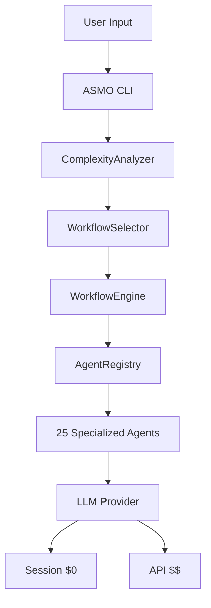

# Phase 3: Documentation & Production Readiness

**Date:** 2026-02-09
**Status:** Planning
**Focus:** Complete documentation from scratch + production improvements

---

## Overview

Phase 2 cleaned up the codebase. Phase 3 will create **complete user-facing documentation** and improve **production readiness**.

**Goal:** Make ASMO easy to understand, use, and maintain for new users.

---

## Phase 3 Priorities

### 🎯 Priority 1: Complete Documentation (NEW)
**Why:** System is new, users need comprehensive docs to get started
**Time:** 2-3 weeks
**Focus:** User guides, tutorials, examples, architecture docs

### 🎯 Priority 2: Developer Experience
**Why:** Make it easy to verify docs stay accurate
**Time:** 1 week
**Focus:** Automated verification, tooling improvements

### 🎯 Priority 3: Production Readiness
**Why:** Ensure system is reliable and performant
**Time:** 2-3 weeks
**Focus:** Error handling, monitoring, performance

---

## Part 1: Complete Documentation (Priority 1)

### 1.1 User Documentation (1 week)

#### A. Getting Started Guide (4h)
**File:** `docs/getting-started.md`

**Content:**
```markdown
# Getting Started with ASMO

## What is ASMO?
AI System for Multiagent Orchestration - automatically routes tasks to
specialized AI agents and workflows.

## Installation
```bash
npm install -g @asmo/cli
# or
pnpm add @asmo/cli
```

## Quick Start
```bash
# 1. Analyze a task
asmo suggest "Fix authentication bug"

# 2. Run ASMO
asmo run "Add user profile page"

# 3. Check available workflows
asmo workflow
```

## Your First Task
[Step-by-step tutorial...]

## What's Next?
- Read User Guide for detailed features
- See Workflow Guide for choosing workflows
- Check Examples for common scenarios
```

#### B. User Guide (6h)
**File:** `docs/user-guide.md`

**Sections:**
1. **Core Concepts** (1h)
   - What are agents?
   - What are workflows?
   - How does routing work?
   - What is complexity analysis?

2. **Using ASMO** (2h)
   - CLI commands reference
   - Running workflows
   - Understanding output
   - Approval checkpoints

3. **Workflows Guide** (2h)
   - When to use which workflow
   - Workflow categories (development, testing, planning)
   - Adaptive workflows explained
   - Phase joining

4. **Configuration** (1h)
   - Environment variables
   - Dual LLM strategy (Session vs API)
   - YOLO mode
   - Custom settings

#### C. Workflow Decision Guide (3h)
**File:** `docs/workflow-guide.md`

**Content:**
- **Decision tree** (interactive flowchart)
- **Workflow comparison table**
- **When to use each workflow** (with examples)
- **Common scenarios** (bug fix, new feature, testing, etc.)

Example:
```markdown
## Choosing a Workflow

### I need to fix a bug
→ Use `bug_fix_workflow` (adaptive)
  - Simple bug (typo): 3 steps, ~1h
  - Complex bug (race condition): 5 steps, ~3h

### I need to add a feature
→ Small feature? Use `dev_story_workflow` (2h)
→ Full feature? Use `feature_implementation_full` (6h)

### I need to test
→ Plan tests? Use `tea_planning_workflow` (3-5h)
→ Execute tests? Use `tea_execution_workflow` (3.5-6h)
→ Validate quality? Use `tea_validation_workflow` (2-3h)
```

#### D. Examples & Tutorials (4h)
**Directory:** `docs/examples/`

**Files:**
1. `01-simple-bug-fix.md` - Step-by-step bug fix
2. `02-add-feature.md` - Complete feature implementation
3. `03-testing-workflow.md` - Test planning and execution
4. `04-architecture-design.md` - System architecture design
5. `05-code-review.md` - Code review workflow
6. `06-security-audit.md` - Security audit

Each example:
- **Scenario** description
- **Command** to run
- **Expected output**
- **What happened** (explanation)
- **Next steps**

#### E. FAQ (2h)
**File:** `docs/faq.md`

**Sections:**
- General questions
- Workflow selection
- Error handling
- Performance
- Cost (Session vs API)
- Troubleshooting

---

### 1.2 Developer Documentation (1 week)

#### A. Architecture Overview (4h)
**File:** `docs/architecture.md`

**Content:**
1. **System Architecture**
   - High-level diagram
   - Component overview
   - Data flow

2. **Core Components**
   - DynamicOrchestrator
   - ComplexityAnalyzer
   - WorkflowEngine
   - AgentRegistry
   - TaskRouter

3. **LLM Strategy**
   - Session Provider ($0)
   - API Provider (pay-per-use)
   - Auto-fallback logic

4. **Workflow System**
   - How workflows are loaded
   - Adaptive phase detection
   - Phase join criteria
   - Complexity-based skipping

#### B. Agent Development Guide (3h)
**File:** `docs/developing-agents.md`

**Content:**
1. **Creating a New Agent**
```typescript
import { BaseAgent } from '@asmo/core'

export class MyAgent extends BaseAgent {
  async execute(task: string): Promise<string> {
    // Agent logic here
    return this.createResult({
      success: true,
      result: 'Task completed'
    })
  }
}
```

2. **Agent Best Practices**
   - When to create new agent vs use existing
   - Naming conventions
   - Role definitions
   - Skill assignments

3. **Testing Agents**

#### C. Workflow Development Guide (3h)
**File:** `docs/developing-workflows.md`

**Content:**
1. **Workflow JSON Structure**
```json
{
  "id": "my_workflow",
  "name": "My Workflow",
  "steps": [...],
  "phases": [...],
  "metadata": {
    "adaptive_phase_detection": true,
    "complexity_aware": true
  }
}
```

2. **Adding Adaptive Features**
   - Complexity-based skipping
   - Conditional deliverables
   - Adaptive timeouts

3. **Phase Join Criteria**

4. **Testing Workflows**

#### D. API Reference (2h)
**File:** `docs/api-reference.md`

**Content:**
- Core exports from @asmo/core
- Type definitions
- Function signatures
- Usage examples

#### E. Contributing Guide (2h)
**File:** `CONTRIBUTING.md`

**Content:**
1. Development setup
2. Code style
3. Testing requirements
4. Pull request process
5. Documentation standards

---

### 1.3 Architecture Diagrams (4h)

#### A. System Architecture Diagram
**Tool:** Mermaid or similar
**File:** `docs/diagrams/system-architecture.md`



#### B. Workflow Execution Flow
**File:** `docs/diagrams/workflow-execution.md`

#### C. Agent Selection Flow
**File:** `docs/diagrams/agent-selection.md`

#### D. TEA Workflows Flow
**File:** `docs/diagrams/tea-workflows.md`

---

## Part 2: Developer Experience (Priority 2)

### 2.1 Automated Documentation Verification (2h)

**Goal:** Prevent docs from becoming outdated

**Implementation:**
```typescript
// packages/cli/src/commands/verify-docs.ts
export async function verifyDocs() {
  console.log('🔍 Verifying documentation...\n')

  // 1. Count resources
  const actual = {
    agents: countAgentFiles(),
    workflows: countWorkflowFiles(),
    roles: countRoles()
  }

  // 2. Check CLAUDE.md
  const claudeMd = parseCLAUDEmd()
  const claudeErrors = []

  if (claudeMd.agents !== actual.agents) {
    claudeErrors.push(`Agents: ${claudeMd.agents} (doc) vs ${actual.agents} (actual)`)
  }
  if (claudeMd.workflows !== actual.workflows) {
    claudeErrors.push(`Workflows: ${claudeMd.workflows} (doc) vs ${actual.workflows} (actual)`)
  }

  // 3. Check PRD
  const prd = parsePRD()
  const prdErrors = []
  // ... similar checks

  // 4. Report
  if (claudeErrors.length === 0 && prdErrors.length === 0) {
    console.log('✅ All documentation verified!')
    console.log(`   Agents: ${actual.agents}`)
    console.log(`   Workflows: ${actual.workflows}`)
    console.log(`   Roles: ${actual.roles}`)
  } else {
    console.error('❌ Documentation verification failed:')
    claudeErrors.forEach(e => console.error(`   - CLAUDE.md: ${e}`))
    prdErrors.forEach(e => console.error(`   - PRD: ${e}`))
    process.exit(1)
  }
}
```

**Integration:**
- Add `asmo verify-docs` command
- Add pre-commit hook
- Add CI/CD check

---

### 2.2 Workflow Decision Tree (Interactive) (3h)

**Goal:** Help users choose the right workflow

**Implementation:**

```typescript
// packages/cli/src/commands/choose-workflow.ts
import inquirer from 'inquirer'

export async function chooseWorkflow() {
  const answers = await inquirer.prompt([
    {
      type: 'list',
      name: 'category',
      message: 'What do you need to do?',
      choices: [
        'Fix a bug',
        'Add a new feature',
        'Testing (plan/execute/validate)',
        'Architecture design',
        'Code review/quality',
        'Other'
      ]
    }
  ])

  switch (answers.category) {
    case 'Fix a bug':
      return await handleBugFix()
    case 'Add a new feature':
      return await handleFeature()
    // ... etc
  }
}

async function handleBugFix() {
  const { complexity } = await inquirer.prompt([
    {
      type: 'list',
      name: 'complexity',
      message: 'Bug complexity?',
      choices: [
        'Simple (typo, config) - 3 steps, ~1h',
        'Medium (logic error) - 4 steps, ~2h',
        'Complex (race condition) - 5 steps, ~3h'
      ]
    }
  ])

  console.log('\n✅ Recommended: bug_fix_workflow (adaptive)')
  console.log('   This workflow will automatically adjust based on complexity\n')

  const { run } = await inquirer.prompt([
    {
      type: 'confirm',
      name: 'run',
      message: 'Run now?',
      default: true
    }
  ])

  if (run) {
    const { task } = await inquirer.prompt([
      {
        type: 'input',
        name: 'task',
        message: 'Describe the bug:'
      }
    ])

    // Execute workflow
    execSync(`asmo workflow bug_fix_workflow --task "${task}"`)
  }
}
```

**Usage:**
```bash
asmo choose-workflow

# Interactive prompts:
? What do you need to do? Fix a bug
? Bug complexity? Medium (logic error) - 4 steps, ~2h

✅ Recommended: bug_fix_workflow (adaptive)
? Run now? Yes
? Describe the bug: Authentication fails on Safari
```

---

### 2.3 Integration Tests (4h)

**Goal:** Ensure workflows execute correctly

**Framework:** Jest

**Tests:**

```typescript
// packages/core/tests/workflows/bug-fix.test.ts
describe('bug_fix_workflow', () => {
  it('loads successfully', async () => {
    const workflow = await loadWorkflow('bug_fix_workflow')
    expect(workflow).toBeDefined()
    expect(workflow.id).toBe('bug_fix_workflow')
  })

  it('has adaptive_phase_detection enabled', async () => {
    const workflow = await loadWorkflow('bug_fix_workflow')
    expect(workflow.metadata.adaptive_phase_detection).toBe(true)
    expect(workflow.metadata.complexity_aware).toBe(true)
  })

  it('skips architect and code-reviewer for simple bugs', async () => {
    const workflow = await loadWorkflow('bug_fix_workflow')
    const steps = getActiveSteps(workflow, { complexity: 20 })

    expect(steps.length).toBe(3)
    expect(steps.map(s => s.role_id)).toEqual([
      'debugger',
      'developer',
      'tester'
    ])
  })

  it('includes all steps for complex bugs', async () => {
    const workflow = await loadWorkflow('bug_fix_workflow')
    const steps = getActiveSteps(workflow, { complexity: 75 })

    expect(steps.length).toBe(5)
    expect(steps.map(s => s.role_id)).toContain('architect')
    expect(steps.map(s => s.role_id)).toContain('code-reviewer')
  })
})

// packages/core/tests/workflows/tea.test.ts
describe('TEA workflows', () => {
  it('tea-planning has 15 steps', async () => {
    const workflow = await loadWorkflow('tea_planning_workflow')
    expect(workflow.steps.length).toBe(15)
  })

  it('tea-planning skips boundary/partition for simple', async () => {
    const workflow = await loadWorkflow('tea_planning_workflow')
    const steps = getActiveSteps(workflow, { complexity: 25 })

    expect(steps.length).toBe(13)
    expect(steps.map(s => s.phase_id)).not.toContain('boundary_analysis')
    expect(steps.map(s => s.phase_id)).not.toContain('equivalence_partitioning')
  })

  it('all 3 TEA workflows have correct deliverable counts', async () => {
    const planning = await loadWorkflow('tea_planning_workflow')
    const execution = await loadWorkflow('tea_execution_workflow')
    const validation = await loadWorkflow('tea_validation_workflow')

    expect(countDeliverables(planning)).toBe(16)
    expect(countDeliverables(execution)).toBe(15)
    expect(countDeliverables(validation)).toBe(10)
  })
})

// packages/core/tests/workflows/all-workflows.test.ts
describe('All workflows', () => {
  it('loads all 27 workflows without errors', async () => {
    const workflows = await loadAllWorkflows()
    expect(workflows.length).toBe(27)

    workflows.forEach(wf => {
      expect(wf.id).toBeDefined()
      expect(wf.name).toBeDefined()
      expect(wf.steps).toBeInstanceOf(Array)
      expect(wf.phases).toBeDefined()
    })
  })

  it('all workflows have valid JSON structure', async () => {
    const workflows = await loadAllWorkflows()

    workflows.forEach(wf => {
      expect(wf.id).toMatch(/^[a-z_]+$/)
      expect(wf.steps.length).toBeGreaterThan(0)
      expect(wf.phases).toBeDefined()
    })
  })

  it('all adaptive workflows have complexity thresholds', async () => {
    const workflows = await loadAllWorkflows()
    const adaptive = workflows.filter(wf => wf.metadata?.complexity_aware)

    adaptive.forEach(wf => {
      expect(wf.metadata.complexity_thresholds).toBeDefined()
      expect(wf.metadata.complexity_thresholds.simple).toBeDefined()
    })
  })
})
```

---

## Part 3: Production Readiness (Priority 3)

### 3.1 Error Handling Improvements (1 week)

#### A. Better Error Messages (2h)
```typescript
// Instead of:
throw new Error('Workflow not found')

// Use:
throw new WorkflowNotFoundError({
  workflowId: 'bug_fix_workflow',
  availableWorkflows: ['bug_fix_workflow', 'feature_implementation_full'],
  suggestion: 'Did you mean "bug_fix_workflow"?'
})
```

#### B. Error Recovery (3h)
- Auto-retry on transient failures
- Graceful degradation (Session → API fallback)
- Clear recovery instructions

#### C. Error Categorization (2h)
- User errors (clear guidance)
- System errors (actionable fixes)
- External errors (LLM API issues)

---

### 3.2 Monitoring & Observability (1 week)

#### A. Workflow Execution Metrics (3h)
```typescript
interface WorkflowMetrics {
  workflowId: string
  startTime: Date
  endTime: Date
  duration: number
  stepsCompleted: number
  stepsSkipped: number
  complexity: number
  success: boolean
  errorType?: string
}
```

#### B. Dashboard (4h)
**Tool:** Simple web dashboard or CLI output

**Metrics:**
- Workflow success rate
- Average execution time
- Most used workflows
- Error rate by workflow
- Cost tracking (Session vs API)

#### C. Logging (1h)
```typescript
logger.info('Workflow started', {
  workflowId: 'bug_fix_workflow',
  complexity: 45,
  adaptiveFeatures: ['skip_architect']
})

logger.debug('Step executing', {
  step: 'debugger',
  phase: 'investigation'
})

logger.error('Workflow failed', {
  workflowId: 'bug_fix_workflow',
  step: 'developer',
  error: 'LLM timeout'
})
```

---

### 3.3 Performance Optimization (1 week)

#### A. Profiling (2h)
- Profile ComplexityAnalyzer
- Profile workflow loading
- Profile agent selection

#### B. Caching (3h)
```typescript
// Cache workflow selections
const workflowCache = new LRUCache<string, string>({
  max: 100,
  ttl: 1000 * 60 * 60 // 1 hour
})

// Cache complexity analysis
const complexityCache = new LRUCache<string, number>({
  max: 500,
  ttl: 1000 * 60 * 30 // 30 minutes
})
```

#### C. Optimization (3h)
- Lazy load workflows
- Parallelize independent operations
- Optimize JSON parsing

---

## Timeline & Milestones

### Week 1: User Documentation
- [ ] Getting Started Guide
- [ ] User Guide (core concepts, usage)
- [ ] Workflow Decision Guide
- [ ] Examples & Tutorials

**Deliverable:** Users can get started and choose workflows easily

### Week 2: Developer Documentation
- [ ] Architecture Overview
- [ ] Agent Development Guide
- [ ] Workflow Development Guide
- [ ] API Reference
- [ ] Contributing Guide

**Deliverable:** Developers can extend ASMO

### Week 3: DX Improvements
- [ ] Doc verification tool
- [ ] Interactive workflow chooser
- [ ] Integration tests
- [ ] Architecture diagrams

**Deliverable:** Automated verification, better UX

### Week 4: Error Handling
- [ ] Better error messages
- [ ] Error recovery
- [ ] Error categorization

**Deliverable:** Clear, actionable errors

### Week 5-6: Monitoring & Performance
- [ ] Workflow metrics
- [ ] Simple dashboard
- [ ] Logging improvements
- [ ] Caching & optimization

**Deliverable:** Observable, fast system

---

## Success Criteria

### Documentation
- [ ] New user can get started in <30 minutes
- [ ] Developer can create agent in <2 hours
- [ ] All workflows documented with examples
- [ ] Architecture fully documented

### Developer Experience
- [ ] Doc verification prevents drift
- [ ] Interactive workflow chooser works
- [ ] Integration tests pass (>80% coverage)

### Production Readiness
- [ ] Clear error messages with recovery steps
- [ ] Metrics collected for all workflows
- [ ] Performance improvement: >20% faster
- [ ] Zero breaking bugs in production

---

## Recommended Order

### Immediate (This Week)
1. **Getting Started Guide** (4h) - HIGHEST PRIORITY
2. **User Guide** (6h) - HIGH PRIORITY
3. **Doc verification tool** (2h) - MEDIUM PRIORITY

**Total:** ~12h

### Next Week
4. **Workflow Guide + Decision Tree** (6h)
5. **Examples & Tutorials** (4h)
6. **Integration Tests** (4h)

**Total:** ~14h

### Following Weeks
7. **Developer Documentation** (14h)
8. **Error Handling** (7h)
9. **Monitoring** (8h)
10. **Performance** (8h)

---

## Quick Wins (Prioritize These)

### 1. Getting Started Guide (4h) ⭐⭐⭐
**Why:** New users need this immediately
**Impact:** HIGH - enables adoption

### 2. Workflow Decision Guide (3h) ⭐⭐⭐
**Why:** Most common user question
**Impact:** HIGH - reduces friction

### 3. Doc Verification (2h) ⭐⭐
**Why:** Prevents future drift
**Impact:** MEDIUM - maintenance

### 4. Examples (4h) ⭐⭐⭐
**Why:** People learn by example
**Impact:** HIGH - understanding

### 5. FAQ (2h) ⭐⭐
**Why:** Answers common questions
**Impact:** MEDIUM - reduces support

---

## Questions for You

1. **Documentation priority?**
   - Start with user docs (recommended)?
   - Or developer docs first?

2. **Examples scope?**
   - 6 examples enough?
   - Specific scenarios you want covered?

3. **Architecture diagrams?**
   - Tool preference? (Mermaid, draw.io, other)
   - Level of detail?

4. **Monitoring?**
   - Simple CLI output enough?
   - Or want web dashboard?

5. **Timeline?**
   - 6 weeks realistic?
   - Want to prioritize differently?

---

## Recommended First 3 Tasks

**Today/This Week (12h):**

1. **Getting Started Guide** (4h)
   - Installation
   - Quick start
   - First task tutorial
   - What's next

2. **User Guide - Core Concepts** (4h)
   - What are agents/workflows
   - How routing works
   - Complexity analysis
   - CLI commands

3. **Workflow Decision Guide** (4h)
   - Decision tree
   - When to use each workflow
   - Common scenarios
   - Quick reference table

**Why these?** New users need to:
1. Get started quickly ✅
2. Understand core concepts ✅
3. Choose the right workflow ✅

---

**Next Action:** Start with Getting Started Guide?

**File to create:** `docs/getting-started.md`

---

**Date:** 2026-02-09
**Plan Version:** 1.0
**Status:** Ready for approval
