# ASMO Workflow Decision Guide

Complete guide to choosing the right workflow for your task.

---

## Quick Decision Tree

```mermaid
flowchart TD
    Start([What do you need to do?])

    Start --> Bug{Fix a bug?}
    Bug -->|Yes| BugFlow[bug_fix_workflow<br/>Adaptive: 1-3h]

    Start --> Feature{Add a feature?}
    Feature -->|Yes| FeatureSize{Feature size?}
    FeatureSize -->|Small<br/>Single component| DevStory[dev_story_workflow<br/>Dev + Test: 2-4h]
    FeatureSize -->|Full feature<br/>Multiple components| FullFeature[feature_implementation_full<br/>Arch + Dev + Test: 4-8h]

    Start --> Testing{Testing?}
    Testing -->|Yes| TestPhase{Which phase?}
    TestPhase -->|Plan tests| TEAPlan[tea_planning_workflow<br/>Risk + Strategy + Design: 3-5h]
    TestPhase -->|Execute tests| TEAExec[tea_execution_workflow<br/>Automation + Regression: 3.5-6h]
    TestPhase -->|Validate quality| TEAVal[tea_validation_workflow<br/>Quality Gates + Release: 2-3h]
    TestPhase -->|Create test suite| CompTest[comprehensive_testing<br/>Complete suite: 3-6h]

    Start --> Design{Architecture/Design?}
    Design -->|Yes| DesignType{What type?}
    DesignType -->|System architecture| ArchDesign[architecture_design<br/>System design: 3-6h]
    DesignType -->|API design| APIDesign[api_design<br/>API contracts: 2-4h]
    DesignType -->|UI components| UILib[ui_component_library<br/>Component system: 4-8h]
    DesignType -->|Database| DBMig[database_migration<br/>Schema migration: 3-6h]

    Start --> Quality{Code quality/review?}
    Quality -->|Yes| QualityType{What kind?}
    QualityType -->|Code review| CodeRev[code_review_workflow<br/>Quality check: 1-2h]
    QualityType -->|Security| SecAudit[security_audit<br/>Security review: 2-4h]
    QualityType -->|Performance| PerfOpt{Optimize or investigate?}
    PerfOpt -->|Optimize| PerfOptFlow[performance_optimization<br/>Speed improvements: 3-6h]
    PerfOpt -->|Investigate| PerfInvest[performance_investigation<br/>Profiling: 2-3h]
    QualityType -->|Critical review| AdvRev[adversarial_review_workflow<br/>Adversarial review: 2-3h]

    Start --> Product{Product/Planning?}
    Product -->|Yes| ProductType{What do you need?}
    ProductType -->|Product brief| ProductBrief[create_product_brief_workflow<br/>2h]
    ProductType -->|PRD| PRD[create_prd_workflow<br/>3-4h]
    ProductType -->|UX design| UX[create_ux_design_workflow<br/>3-5h]
    ProductType -->|Stories| Stories[create_epics_and_stories_workflow<br/>2-3h]
    ProductType -->|Sprint planning| Sprint[sprint_planning_workflow<br/>2h]
    ProductType -->|Retrospective| Retro[retrospective_workflow<br/>1h]

    Start --> Refactor{Refactoring?}
    Refactor -->|Yes| RefactorFlow[code_refactoring<br/>Restructure code: 2-5h]
```



---

## Workflow Catalog

### Core Development (7 workflows)

#### 1. bug_fix_workflow ⭐ **ADAPTIVE**

**When to use:**
- Fix errors in existing code
- Investigate unexpected behavior
- Debug issues

**Complexity:** Simple to Complex (adaptive)

**Time:** 1-3 hours (depends on complexity)

**Agents:**
- Simple bugs: debugger → developer → tester (3 steps)
- Medium bugs: + code-reviewer (4 steps)
- Complex bugs: + architect (5 steps)

**Adaptive Features:**
- Skips architect for simple bugs (saves 40%)
- Skips code-reviewer for simple bugs
- Full workflow for complex bugs

**Examples:**
```bash
# Simple bug (typo, config)
asmo run "Fix typo in validation message"
# → 3 steps, ~1h

# Medium bug (logic error)
asmo run "Fix incorrect calculation in shopping cart total"
# → 4 steps, ~2h

# Complex bug (architecture issue)
asmo run "Fix race condition in user authentication flow"
# → 5 steps, ~3h
```

**Deliverables:**
- bug-analysis.md (root cause)
- fix-implementation.md (solution)
- test-results.md (validation)
- Code changes
- Unit tests

**Best for:**
- ✅ Any bug fix (adaptive)
- ✅ Error investigation
- ✅ Debugging unknown issues

**Not suitable for:**
- ❌ Typos (too simple, just fix manually)
- ❌ New features (use feature workflows)

---

#### 2. feature_implementation_full ⭐ **COMPREHENSIVE**

**When to use:**
- Add complete new features
- Multiple components involved
- Need architecture review

**Complexity:** Medium to Complex

**Time:** 4-8 hours

**Phases:**
1. **Architecture Design** (architect) - 1-2h
   - System design
   - API contracts
   - Data models

2. **Development** (developer) - 2-4h
   - Frontend implementation
   - Backend implementation
   - Integration

3. **Testing** (tester) - 1-2h
   - Unit tests
   - Integration tests
   - E2E tests (if needed)

**Examples:**
```bash
# User-facing feature
asmo run "Add user profile page with avatar, bio, and settings"

# Backend feature
asmo run "Add payment processing with Stripe integration"

# Full-stack feature
asmo run "Add real-time notifications with WebSocket"
```

**Deliverables:**
- architecture-design.md
- api-contracts.yaml
- implementation-guide.md
- Source code
- Tests
- Documentation

**Best for:**
- ✅ Complete features (UI + backend)
- ✅ Multiple components
- ✅ Need architectural planning

**Not suitable for:**
- ❌ Simple additions (use dev_story_workflow)
- ❌ Just UI changes (use dev_story_workflow)

---

#### 3. dev_story_workflow ⭐ **STREAMLINED**

**When to use:**
- Implement user stories
- Small to medium features
- No architecture changes

**Complexity:** Simple to Medium

**Time:** 2-4 hours

**Agents:**
- developer → tester (2 agents)

**No architecture phase** - Goes straight to implementation.

**Examples:**
```bash
# UI-only feature
asmo run "Add 'remember me' checkbox to login form"

# Single component
asmo run "Add email validation to signup form"

# Small backend change
asmo run "Add 'delete account' endpoint to user API"
```

**Deliverables:**
- implementation.md
- Source code
- Unit tests
- Integration tests (if needed)

**Best for:**
- ✅ User stories from sprint
- ✅ Single components
- ✅ No architectural changes

**Not suitable for:**
- ❌ Complex features (use feature_implementation_full)
- ❌ Multiple components (use feature_implementation_full)

---

#### 4. code_refactoring

**When to use:**
- Restructure existing code
- Improve code quality
- No behavior changes

**Complexity:** Medium

**Time:** 2-5 hours

**Agents:**
- architect → developer

**Examples:**
```bash
# Extract components
asmo run "Extract UserProfile component from Dashboard"

# Refactor to use hooks
asmo run "Refactor UserList class component to functional with hooks"

# Improve structure
asmo run "Refactor authentication logic to use AuthService"
```

**Deliverables:**
- refactoring-plan.md
- implementation.md
- Refactored code
- Tests (updated)

**Best for:**
- ✅ Code restructuring
- ✅ Extract components/modules
- ✅ Improve maintainability

**Not suitable for:**
- ❌ Behavior changes (use feature workflows)
- ❌ Bug fixes (use bug_fix_workflow)

---

#### 5. code_review_workflow

**When to use:**
- Review code quality
- Check best practices
- Validate PR before merge

**Complexity:** Simple to Medium

**Time:** 1-2 hours

**Agents:**
- code-reviewer → developer (optional fixes)

**Examples:**
```bash
# PR review
asmo workflow code_review_workflow --task "Review PR #123: Add payment processing"

# Code quality check
asmo run "Review authentication module for code quality"

# Pre-merge validation
asmo run "Review and validate branch feature/user-auth before merge"
```

**Deliverables:**
- code-review.md
- quality-score.md
- recommendations.md
- Fixes (if requested)

**Best for:**
- ✅ PR reviews
- ✅ Code quality checks
- ✅ Pre-merge validation

**Not suitable for:**
- ❌ Security audits (use security_audit)
- ❌ Performance review (use performance workflows)

---

#### 6. create_story_workflow

**When to use:**
- Create user stories from requirements
- Break down epics

**Complexity:** Simple

**Time:** 1 hour

**Agents:**
- product-owner → developer

**Examples:**
```bash
asmo run "Create user stories for 'User Authentication' epic"
```

**Deliverables:**
- user-stories.md
- acceptance-criteria.md

---

### Architecture & Design (3 workflows)

#### 7. architecture_design ⭐ **SYSTEM DESIGN**

**When to use:**
- Design system architecture
- Major architectural changes
- Technology decisions

**Complexity:** Complex

**Time:** 3-6 hours

**Agent:**
- architect

**Examples:**
```bash
# Microservices
asmo workflow architecture_design --task "Design microservices architecture for e-commerce platform"

# Scalability
asmo run "Design architecture for handling 1M concurrent users"

# Migration
asmo run "Design migration from monolith to microservices"
```

**Deliverables:**
- architecture-design.md
- system-diagram.md (Mermaid)
- component-design.md
- technology-decisions.md
- implementation-roadmap.md

**Best for:**
- ✅ System architecture
- ✅ Major redesigns
- ✅ Technology evaluations

**Not suitable for:**
- ❌ Implementation (use feature_implementation_full)
- ❌ API-only design (use api_design)

---

#### 8. api_design ⭐ **API CONTRACTS**

**When to use:**
- Design REST/GraphQL APIs
- Create API contracts
- Define endpoints

**Complexity:** Medium

**Time:** 2-4 hours

**Agents:**
- api-designer → developer

**Examples:**
```bash
# REST API
asmo workflow api_design --task "Design REST API for user management (CRUD + auth)"

# GraphQL
asmo run "Design GraphQL schema for blog platform"

# API versioning
asmo run "Design API v2 with backward compatibility"
```

**Deliverables:**
- api-design.md
- api-contracts.yaml (OpenAPI)
- endpoint-documentation.md
- Sample requests/responses

**Best for:**
- ✅ API design
- ✅ Endpoint definition
- ✅ API contracts

**Not suitable for:**
- ❌ Implementation (use feature_implementation_full)
- ❌ System architecture (use architecture_design)

---

#### 9. ui_component_library

**When to use:**
- Build component library
- Create design system
- Reusable UI components

**Complexity:** Complex

**Time:** 4-8 hours

**Agents:**
- ux-designer → ui-developer → tester

**Examples:**
```bash
asmo run "Create design system with Button, Input, Card, Modal components"
```

**Deliverables:**
- design-system.md
- component-specs.md
- React/Vue/Angular components
- Storybook stories
- Component tests

---

### Quality & Testing (5 workflows)

#### 10. comprehensive_testing ⭐ **COMPLETE TEST SUITE**

**When to use:**
- Create complete test suite
- Test existing feature
- Improve test coverage

**Complexity:** Medium to Complex

**Time:** 3-6 hours

**Agents:**
- test-architect → developer → tester

**Examples:**
```bash
# Test suite for feature
asmo run "Create comprehensive tests for user authentication"

# Increase coverage
asmo run "Add tests to improve checkout flow coverage to 90%"

# E2E tests
asmo run "Create E2E tests for complete user journey"
```

**Deliverables:**
- test-strategy.md
- Unit tests
- Integration tests
- E2E tests (if applicable)
- test-coverage-report.md

**Best for:**
- ✅ Complete test suites
- ✅ Improving coverage
- ✅ Testing existing features

**Not suitable for:**
- ❌ Test planning (use tea_planning_workflow)
- ❌ Test strategy only (use tea workflows)

---

#### 11. security_audit ⭐ **SECURITY REVIEW**

**When to use:**
- Security review
- Vulnerability scan
- Pre-release security check

**Complexity:** Medium to Complex

**Time:** 2-4 hours

**Agents:**
- security-specialist → developer (fixes)

**Examples:**
```bash
# Security review
asmo workflow security_audit --task "Audit authentication and authorization code"

# Vulnerability scan
asmo run "Check payment processing for security vulnerabilities"

# Pre-release audit
asmo run "Security audit before v2.0 release"
```

**Deliverables:**
- security-audit-report.md
- vulnerabilities.md
- recommendations.md
- Fixes (if critical)

**Best for:**
- ✅ Security audits
- ✅ Vulnerability detection
- ✅ Pre-release security checks

**Not suitable for:**
- ❌ General code review (use code_review_workflow)
- ❌ Performance review (use performance workflows)

---

#### 12. performance_optimization ⭐ **SPEED IMPROVEMENTS**

**When to use:**
- Optimize slow code
- Improve performance
- Reduce memory usage

**Complexity:** Complex

**Time:** 3-6 hours

**Agents:**
- performance-engineer (or optimizer) → developer

**Examples:**
```bash
# Database optimization
asmo run "Optimize slow database queries in user search"

# Frontend performance
asmo run "Improve page load time from 3s to <1s"

# Memory optimization
asmo run "Reduce memory usage in data processing pipeline"
```

**Deliverables:**
- performance-analysis.md
- optimization-plan.md
- Optimized code
- Benchmarks (before/after)
- performance-report.md

**Best for:**
- ✅ Performance optimization
- ✅ Speed improvements
- ✅ Memory reduction

**Not suitable for:**
- ❌ Performance investigation only (use performance_investigation)
- ❌ Profiling only (use performance_investigation)

---

#### 13. performance_investigation

**When to use:**
- Profile performance issues
- Identify bottlenecks
- Analyze performance (no fixes)

**Complexity:** Medium

**Time:** 2-3 hours

**Agent:**
- performance-engineer

**Examples:**
```bash
# Identify bottlenecks
asmo run "Profile and identify performance bottlenecks in dashboard loading"

# Memory leak investigation
asmo run "Investigate memory leak in long-running background job"
```

**Deliverables:**
- profiling-report.md
- bottlenecks.md
- recommendations.md

**Best for:**
- ✅ Performance profiling
- ✅ Bottleneck identification
- ✅ Investigation only

**Not suitable for:**
- ❌ Implementation (use performance_optimization)

---

#### 14. adversarial_review_workflow

**When to use:**
- Critical code review
- Find edge cases
- Adversarial testing

**Complexity:** Medium

**Time:** 2-3 hours

**Agent:**
- adversarial-reviewer

**Examples:**
```bash
# Critical review
asmo workflow adversarial_review_workflow --task "Critically review payment processing logic"

# Edge cases
asmo run "Find edge cases in user input validation"
```

**Deliverables:**
- adversarial-review.md
- edge-cases.md
- vulnerabilities.md

---

### TEA (3 workflows) ⭐ **TEST ENGINEERING & AUTOMATION**

#### 15. tea_planning_workflow ⭐ **TEST PLANNING**

**When to use:**
- Plan test strategy
- Risk assessment
- Test design

**Complexity:** Medium

**Time:** 3-5 hours (adaptive)

**Consolidates:**
- Risk assessment (tea-1)
- Test strategy (tea-2)
- Test design (tea-3)

**Phases:**
1. **Risk Assessment** - Identify test risks
2. **Test Strategy** - Define approach
3. **Test Design** - Design test cases

**Adaptive Features:**
- Skips boundary/equivalence analysis for simple projects
- Full analysis for complex projects

**Examples:**
```bash
# Plan tests for feature
asmo workflow tea_planning_workflow --task "Plan tests for checkout flow"

# Test strategy
asmo run "Create test strategy for payment processing"

# Risk assessment
asmo run "Assess testing risks for multi-tenant architecture"
```

**Deliverables (16):**
- risk-assessment.md
- test-strategy.md
- test-design.md
- test-cases.md
- test-data-strategy.md
- And 11 more detailed documents

**Best for:**
- ✅ Test planning
- ✅ Test strategy
- ✅ Risk assessment

**Not suitable for:**
- ❌ Test execution (use tea_execution_workflow)
- ❌ Quick test creation (use comprehensive_testing)

---

#### 16. tea_execution_workflow ⭐ **TEST EXECUTION**

**When to use:**
- Implement test automation
- Execute regression tests
- Maintain test suite

**Complexity:** Complex

**Time:** 3.5-6 hours (adaptive)

**Consolidates:**
- Test automation (tea-4)
- Regression analysis (tea-7)
- Test maintenance (tea-8)

**Phases:**
1. **Test Automation** - Implement automated tests
2. **Regression Testing** - Execute regression suite
3. **Test Maintenance** - Update and maintain tests

**Adaptive Features:**
- Skips framework design for simple projects
- Full automation pipeline for complex projects

**Examples:**
```bash
# Implement test automation
asmo workflow tea_execution_workflow --task "Implement automated E2E tests for user journey"

# Regression testing
asmo run "Execute regression tests for v2.0 release"

# Test maintenance
asmo run "Update and maintain test suite after API changes"
```

**Deliverables (15):**
- automation-framework.md
- automated-tests (code)
- regression-suite.md
- test-maintenance-report.md
- And 11 more artifacts

**Best for:**
- ✅ Test automation
- ✅ Regression testing
- ✅ Test maintenance

**Not suitable for:**
- ❌ Test planning (use tea_planning_workflow)
- ❌ Quality validation (use tea_validation_workflow)

---

#### 17. tea_validation_workflow ⭐ **QUALITY VALIDATION**

**When to use:**
- Quality gates
- Release readiness
- Go/No-Go decision

**Complexity:** Medium

**Time:** 2-3 hours

**Consolidates:**
- Quality gates (tea-5)
- Release readiness (tea-6)

**Phases:**
1. **Quality Gates** - Validate quality metrics
2. **Release Readiness** - Assess release criteria

**Examples:**
```bash
# Release validation
asmo workflow tea_validation_workflow --task "Validate release v2.0 quality and readiness"

# Quality gates
asmo run "Check if sprint deliverables meet quality gates"

# Go/No-Go decision
asmo run "Assess if feature is ready for production deployment"
```

**Deliverables (10):**
- quality-gates-report.md
- release-readiness-checklist.md
- go-no-go-recommendation.md
- quality-metrics.md
- And 6 more artifacts

**Best for:**
- ✅ Quality validation
- ✅ Release readiness
- ✅ Go/No-Go decisions

**Not suitable for:**
- ❌ Test planning (use tea_planning_workflow)
- ❌ Test execution (use tea_execution_workflow)

---

### Product & Planning (8 workflows)

#### 18-25. Product Workflows

| Workflow | Purpose | Time |
|----------|---------|------|
| `create_product_brief_workflow` | Problem statement, solution overview | 2h |
| `create_prd_workflow` | Detailed requirements, user stories | 3-4h |
| `create_ux_design_workflow` | User experience design | 3-5h |
| `create_epics_and_stories_workflow` | Break down features into stories | 2-3h |
| `sprint_planning_workflow` | Plan sprint, estimate stories | 2h |
| `check_implementation_readiness_workflow` | Check if ready to implement | 1h |
| `correct_course_workflow` | Course correction, replanning | 1-2h |
| `retrospective_workflow` | Sprint retrospective | 1h |

**Examples:**
```bash
# Product brief
asmo workflow create_product_brief_workflow --task "Create product brief for mobile app"

# PRD
asmo workflow create_prd_workflow --task "Create PRD for user authentication feature"

# Sprint planning
asmo workflow sprint_planning_workflow --task "Plan Sprint 12 (Aug 1-14)"

# Retrospective
asmo workflow retrospective_workflow --task "Sprint 11 retrospective"
```

---

### Database (1 workflow)

#### 26. database_migration

**When to use:**
- Database schema changes
- Data migrations
- Database technology change

**Complexity:** Complex

**Time:** 3-6 hours

**Agents:**
- data-architect → developer → tester

**Examples:**
```bash
# Schema change
asmo workflow database_migration --task "Add user_preferences table with foreign key to users"

# Data migration
asmo run "Migrate user data from MySQL to PostgreSQL"

# Schema evolution
asmo run "Add multi-tenancy support to database schema"
```

**Deliverables:**
- migration-plan.md
- schema-changes.sql
- data-migration-script.sql
- rollback-plan.md
- migration-test-results.md

---

## Workflow Selection Matrix

### By Task Type

| Task Type | Recommended Workflow | Alternative |
|-----------|---------------------|-------------|
| **Bug fix** | `bug_fix_workflow` | - |
| **Small feature** | `dev_story_workflow` | `feature_implementation_full` |
| **Full feature** | `feature_implementation_full` | - |
| **Refactoring** | `code_refactoring` | - |
| **Test creation** | `comprehensive_testing` | TEA workflows |
| **Test planning** | `tea_planning_workflow` | - |
| **Test execution** | `tea_execution_workflow` | - |
| **Quality validation** | `tea_validation_workflow` | - |
| **Security** | `security_audit` | `adversarial_review_workflow` |
| **Performance** | `performance_optimization` | `performance_investigation` |
| **Architecture** | `architecture_design` | - |
| **API design** | `api_design` | - |
| **Code review** | `code_review_workflow` | `adversarial_review_workflow` |
| **Database** | `database_migration` | - |

---

### By Complexity

| Complexity | Workflows |
|-----------|-----------|
| **Simple (0-39)** | `dev_story_workflow`, `create_story_workflow`, `code_review_workflow` |
| **Medium (40-69)** | `bug_fix_workflow`, `comprehensive_testing`, `api_design`, TEA workflows |
| **Complex (70-100)** | `feature_implementation_full`, `architecture_design`, `performance_optimization`, `database_migration` |

---

### By Time Budget

| Time Available | Workflows |
|---------------|-----------|
| **< 2 hours** | `create_story_workflow`, `retrospective_workflow`, `code_review_workflow` |
| **2-4 hours** | `bug_fix_workflow`, `dev_story_workflow`, `api_design`, `security_audit` |
| **4-6 hours** | `feature_implementation_full`, `comprehensive_testing`, `performance_optimization`, TEA workflows |
| **6+ hours** | `ui_component_library`, `tea_execution_workflow`, `architecture_design` |

---

## Common Scenarios

### Scenario 1: "I found a bug"

**Questions:**
1. How complex is the bug?
   - Typo/config → Fix manually (don't use ASMO)
   - Logic error → Use ASMO
   - Architecture issue → Use ASMO

2. Do you know the root cause?
   - No → `bug_fix_workflow` (includes investigation)
   - Yes → `dev_story_workflow` (skip investigation)

**Recommended:**
```bash
asmo run "Fix [describe bug]"
# ASMO auto-selects bug_fix_workflow
```

---

### Scenario 2: "I need to add a feature"

**Questions:**
1. How many components involved?
   - Single component → `dev_story_workflow`
   - Multiple components → `feature_implementation_full`

2. Do you need architecture review?
   - No (straightforward) → `dev_story_workflow`
   - Yes (complex) → `feature_implementation_full`

3. Time budget?
   - 2-4 hours → `dev_story_workflow`
   - 4-8 hours → `feature_implementation_full`

**Recommended:**
```bash
# Let ASMO decide based on complexity
asmo run "Add [describe feature]"
```

---

### Scenario 3: "I need to test something"

**Questions:**
1. What phase are you in?
   - Planning → `tea_planning_workflow`
   - Execution → `tea_execution_workflow`
   - Validation → `tea_validation_workflow`

2. Do you need comprehensive testing?
   - Quick test suite → `comprehensive_testing`
   - Full test strategy → TEA workflows

**Recommended:**
```bash
# For test planning
asmo workflow tea_planning_workflow --task "Plan tests for [feature]"

# For quick test suite
asmo run "Create tests for [feature]"
```

---

### Scenario 4: "I need a code review"

**Questions:**
1. What type of review?
   - General quality → `code_review_workflow`
   - Security → `security_audit`
   - Performance → `performance_investigation`
   - Critical review → `adversarial_review_workflow`

**Recommended:**
```bash
# Code quality
asmo workflow code_review_workflow --task "Review PR #123"

# Security
asmo workflow security_audit --task "Audit [code/feature]"
```

---

### Scenario 5: "Performance is slow"

**Questions:**
1. What do you need?
   - Find bottlenecks → `performance_investigation`
   - Fix performance → `performance_optimization`

**Recommended:**
```bash
# Investigate first
asmo workflow performance_investigation --task "Profile [slow operation]"

# Then optimize
asmo workflow performance_optimization --task "Optimize [bottleneck]"
```

---

## Quick Reference Table

| I want to... | Use this workflow | Command |
|--------------|-------------------|---------|
| Fix a bug | `bug_fix_workflow` | `asmo run "Fix [bug]"` |
| Add a small feature | `dev_story_workflow` | `asmo run "Add [feature]"` |
| Add a full feature | `feature_implementation_full` | `asmo run "Add [feature]"` |
| Refactor code | `code_refactoring` | `asmo run "Refactor [code]"` |
| Review code | `code_review_workflow` | `asmo workflow code_review_workflow --task "Review PR #X"` |
| Audit security | `security_audit` | `asmo workflow security_audit --task "Audit [code]"` |
| Optimize performance | `performance_optimization` | `asmo run "Optimize [slow operation]"` |
| Investigate performance | `performance_investigation` | `asmo run "Profile [operation]"` |
| Design architecture | `architecture_design` | `asmo workflow architecture_design --task "Design [system]"` |
| Design API | `api_design` | `asmo workflow api_design --task "Design API for [feature]"` |
| Plan tests | `tea_planning_workflow` | `asmo workflow tea_planning_workflow --task "Plan tests for [feature]"` |
| Execute tests | `tea_execution_workflow` | `asmo workflow tea_execution_workflow --task "Implement tests for [feature]"` |
| Validate quality | `tea_validation_workflow` | `asmo workflow tea_validation_workflow --task "Validate [release]"` |
| Create test suite | `comprehensive_testing` | `asmo run "Create tests for [feature]"` |
| Migrate database | `database_migration` | `asmo workflow database_migration --task "Migrate [schema change]"` |

---

## When NOT to Use Workflows

Some tasks are too simple for ASMO workflows:

| Task | Why not use ASMO | What to do instead |
|------|------------------|-------------------|
| Fix typo | Too simple | Just fix it manually |
| Single-line change | No coordination needed | Edit directly |
| Read/explore code | No output needed | Use IDE/grep |
| Ask question | No code changes | Ask Claude directly |
| Update comment | Too trivial | Edit manually |

**Rule of thumb:**
- If task takes < 5 minutes manually → Don't use ASMO
- If task needs multiple files or investigation → Use ASMO

---

## Tips for Choosing Workflows

### 1. Let ASMO Decide (Recommended)

```bash
# Trust automatic selection
asmo run "Your task description"
```

ASMO analyzes complexity and selects the optimal workflow.

---

### 2. Use `suggest` for Guidance

```bash
asmo suggest "Your task"
```

See ASMO's recommendation before execution.

---

### 3. Start Small

For new features, start with smaller workflows:

```bash
# Start with dev_story_workflow
asmo run "Add user profile component"

# If it grows, use feature_implementation_full
asmo run "Add complete user profile system with settings and preferences"
```

---

### 4. Chain Workflows for Complex Projects

```bash
# Step 1: Design
asmo workflow architecture_design --task "Design user authentication system"

# Step 2: Implement
asmo workflow feature_implementation_full --task "Implement authentication based on design"

# Step 3: Secure
asmo workflow security_audit --task "Audit authentication implementation"

# Step 4: Test
asmo workflow tea_execution_workflow --task "Create comprehensive authentication tests"
```

---

### 5. Match Workflow to Project Phase

| Project Phase | Workflows |
|--------------|-----------|
| **Planning** | Product workflows, `tea_planning_workflow` |
| **Design** | `architecture_design`, `api_design`, `create_ux_design_workflow` |
| **Development** | `feature_implementation_full`, `dev_story_workflow` |
| **Testing** | TEA workflows, `comprehensive_testing` |
| **Review** | `code_review_workflow`, `security_audit`, `adversarial_review_workflow` |
| **Deployment** | `check_implementation_readiness_workflow`, `tea_validation_workflow` |
| **Maintenance** | `bug_fix_workflow`, `code_refactoring`, `performance_optimization` |

---

## Next Steps

- **[Getting Started](./getting-started.md)** - Installation and first steps
- **[User Guide](./user-guide.md)** - Complete user guide
- **[Examples](./examples/)** - Real-world workflow examples
- **[FAQ](./faq.md)** - Common questions

---

**Still not sure which workflow to use?**

```bash
# Ask ASMO for a recommendation
asmo suggest "Describe your task here"

# Or just run it and let ASMO decide
asmo run "Your task here"
```

ASMO's complexity analysis will choose the optimal workflow for you! 🚀
