# Workflow Decision Tree

**Version:** 1.0.0
**Last Updated:** 2026-02-09

---

## Quick Decision Tree (Visual)

```mermaid
graph TD
    Start([What are you doing?]) --> TaskType{Task Type?}

    TaskType -->|New Product| NewProduct[Product from scratch?]
    TaskType -->|Feature| FeatureType{Feature size?}
    TaskType -->|Bug| BugComplexity{Bug complexity?}
    TaskType -->|Refactor| RefactorScope{Scope?}
    TaskType -->|Quality| QualityType{Quality concern?}
    TaskType -->|Architecture| ArchType{Architecture task?}
    TaskType -->|Other| OtherType{What specifically?}

    NewProduct -->|Yes| ProductBrief[create-product-brief]
    NewProduct -->|No, have PRD| CreateArch[create-architecture]

    FeatureType -->|Small| QuickFlow[quick-flow]
    FeatureType -->|Medium| CreateStory[create-story → dev-story]
    FeatureType -->|Large| FeatureFull[create-prd → architecture → epics]

    BugComplexity -->|Simple| BugFix[bug-fix]
    BugComplexity -->|Complex| AdvReview[adversarial-review → bug-fix]

    RefactorScope -->|Single file| QuickFlow2[quick-flow]
    RefactorScope -->|Multiple files| Refactoring[refactoring]
    RefactorScope -->|Architectural| ArchDesign[architecture-design]

    QualityType -->|Testing| TestingChoice{What testing?}
    QualityType -->|Performance| PerfOpt[performance-optimization]
    QualityType -->|Security| SecAudit[security-audit]
    QualityType -->|Code Review| CodeReview[code-review or adversarial-review]

    TestingChoice -->|Create tests| AutomateTests[automate-tests]
    TestingChoice -->|Test strategy| TEAStrategy[tea-test-strategy]
    TestingChoice -->|Full QA| QA[comprehensive-testing]

    ArchType -->|Design new| ArchDesign2[architecture-design]
    ArchType -->|Review existing| ArchReview[adversarial-review]
    ArchType -->|API design| APIDesign[api-design]
    ArchType -->|DB schema| DBMigration[database-migration]

    OtherType -->|Documentation| QuickFlow3[quick-flow]
    OtherType -->|Planning| PlanningChoice{Planning what?}
    OtherType -->|Retrospective| Retro[retrospective]

    PlanningChoice -->|Sprint| SprintPlan[sprint-planning]
    PlanningChoice -->|Epic| CreateEpics[create-epics-and-stories]
    PlanningChoice -->|Story| CreateStory2[create-story]

    style Start fill:#90EE90
    style TaskType fill:#FFD700
    style ProductBrief fill:#4FC3F7
    style BugFix fill:#FF6B6B
    style QuickFlow fill:#9370DB
```



---

## Interactive Decision Guide

### Question 1: What are you doing?

**A. Starting a new product/project from scratch**
→ Go to [New Product Flow](#new-product-flow)

**B. Adding a feature to existing product**
→ Go to [Feature Development Flow](#feature-development-flow)

**C. Fixing a bug**
→ Go to [Bug Fix Flow](#bug-fix-flow)

**D. Refactoring existing code**
→ Go to [Refactoring Flow](#refactoring-flow)

**E. Quality/Testing work**
→ Go to [Quality Assurance Flow](#quality-assurance-flow)

**F. Architecture or design work**
→ Go to [Architecture Flow](#architecture-flow)

**G. Planning or organizational work**
→ Go to [Planning Flow](#planning-flow)

**H. Other (documentation, research, etc.)**
→ Go to [Other Workflows](#other-workflows)

---

## New Product Flow

### Do you have a Product Brief?

**❌ No** → Start here:
```bash
asmo workflow create-product-brief
```
**Output:** Product brief with vision, goals, success metrics

**✅ Yes** → Continue

---

### Do you have a PRD?

**❌ No** → Create PRD:
```bash
asmo workflow create-prd
```
**Output:** Detailed product requirements document

**✅ Yes** → Continue

---

### Does your product have UI?

**✅ Yes** → Create UX design:
```bash
asmo workflow create-ux-design
```
**Output:** UX specifications and wireframes

**❌ No (API/backend only)** → Skip

---

### Create Architecture

```bash
asmo workflow create-architecture
```
**Output:** System architecture design

---

### Break down into work items

```bash
asmo workflow create-epics-and-stories
```
**Output:** Epics and user stories

---

### Ready to implement?

Check readiness:
```bash
asmo workflow check-implementation-readiness
```

If ready → Start sprint:
```bash
asmo workflow sprint-planning
```

Then for each story:
```bash
asmo workflow dev-story --task "story-id"
```

---

## Feature Development Flow

### What's the feature size?

#### Small Feature (< 1 day, few lines of code)
**Example:** Add a button, fix typo, small UI tweak

**Workflow:**
```bash
asmo workflow quick-flow --task "Add logout button to header"
```

**Result:** Quick implementation + test

---

#### Medium Feature (1-3 days, new functionality)
**Example:** Add email notifications, new API endpoint

**Step 1:** Create story (if not existing)
```bash
asmo workflow create-story --task "As a user, I want email notifications for important events"
```

**Step 2:** Implement
```bash
asmo workflow dev-story --task "[story-id]"
```

**Step 3:** Review
```bash
asmo workflow code-review
```

---

#### Large Feature (1+ weeks, multiple components)
**Example:** User authentication system, payment integration

**Full cycle:**
```bash
# 1. Document requirements
asmo workflow create-prd --task "User Authentication System"

# 2. Design architecture
asmo workflow create-architecture

# 3. Break down
asmo workflow create-epics-and-stories

# 4. Implement stories one by one
asmo workflow dev-story --task "[story-1]"
asmo workflow dev-story --task "[story-2]"
# ...

# 5. Quality assurance
asmo workflow comprehensive-testing
asmo workflow security-audit  # If auth/security related
```

---

## Bug Fix Flow

### How complex is the bug?

#### Simple Bug (obvious cause, quick fix)
**Example:** Off-by-one error, typo in logic, missing validation

**Workflow:**
```bash
asmo workflow bug-fix --task "Users can't submit form - submit button disabled"
```

**Includes:** Investigation + fix + test

---

#### Complex Bug (needs investigation)
**Example:** Race condition, memory leak, intermittent failure

**Step 1:** Adversarial investigation
```bash
asmo workflow adversarial-review --task "Investigate memory leak in user service"
```

**Step 2:** Fix
```bash
asmo workflow bug-fix --task "Fix memory leak identified in investigation"
```

**Step 3:** Verify
```bash
asmo workflow comprehensive-testing
```

---

## Refactoring Flow

### What's the scope?

#### Single File/Function
**Example:** Rename variable, extract function, simplify logic

**Workflow:**
```bash
asmo workflow quick-flow --task "Refactor getUserData to use async/await"
```

---

#### Multiple Files/Components
**Example:** Reorganize module structure, extract shared logic

**Workflow:**
```bash
asmo workflow refactoring --task "Extract shared validation logic into utils"
```

---

#### Architectural Refactoring
**Example:** Migrate to new pattern, change database, microservices split

**Step 1:** Design new architecture
```bash
asmo workflow architecture-design --task "Design migration from monolith to microservices"
```

**Step 2:** Create migration plan
```bash
asmo workflow create-epics-and-stories  # Break down migration
```

**Step 3:** Execute refactoring
```bash
asmo workflow refactoring --task "[epic-1]"
# Repeat for each epic
```

**Step 4:** Validate
```bash
asmo workflow comprehensive-testing
asmo workflow performance-optimization  # If performance-critical
```

---

## Quality Assurance Flow

### What quality concern?

#### Testing

**Create automated tests:**
```bash
asmo workflow automate-tests
```

**Comprehensive QA:**
```bash
asmo workflow comprehensive-testing
```

**TEA test strategy:**
```bash
asmo workflow tea-test-strategy
asmo workflow tea-test-design
asmo workflow tea-test-automation
```

---

#### Performance

**Performance issue:**
```bash
asmo workflow performance-optimization --task "API response time is slow"
```

**Proactive optimization:**
```bash
asmo workflow performance-optimization --task "Optimize page load time"
```

---

#### Security

**Security audit:**
```bash
asmo workflow security-audit
```

**Security review of specific code:**
```bash
asmo workflow adversarial-review --task "Security review of auth implementation"
```

---

#### Code Quality

**Standard code review:**
```bash
asmo workflow code-review
```

**Critical/adversarial review:**
```bash
asmo workflow adversarial-review --task "Critical review of payment processing logic"
```

---

## Architecture Flow

### What architecture task?

#### Design New System/Component
```bash
asmo workflow architecture-design --task "Design microservices architecture for order processing"
```

---

#### Review Existing Architecture
```bash
asmo workflow adversarial-review --task "Review current architecture for scalability issues"
```

---

#### API Design
```bash
asmo workflow api-design --task "Design REST API for user management"
```

---

#### Database Schema
```bash
asmo workflow database-migration --task "Add user preferences table and migrate data"
```

---

## Planning Flow

### What are you planning?

#### Sprint Planning
```bash
asmo workflow sprint-planning
```

---

#### Create Epic
```bash
asmo workflow create-epics-and-stories --task "User authentication epic"
```

---

#### Create Story
```bash
asmo workflow create-story --task "As a user, I want to reset my password via email"
```

---

#### Mid-sprint Adjustment
```bash
asmo workflow correct-course --task "Reprioritize remaining sprint stories"
```

---

#### Post-sprint Retrospective
```bash
asmo workflow retrospective
```

---

## Other Workflows

### Documentation
```bash
asmo workflow quick-flow --task "Update README with new API endpoints"
```

### UX Design
```bash
asmo workflow create-ux-design --task "Design onboarding flow"
```

### Release Preparation
```bash
asmo workflow tea-release-readiness
```

---

## Decision by Complexity Score

**ASMO automatically calculates complexity. You can also use:**

```bash
asmo analyze "Your task description"
```

**Example output:**
```
Complexity Score: 45/100
Complexity Level: medium
Recommended Workflow: feature-development
```

### Score Ranges

| Score | Level | Recommended Workflows |
|-------|-------|----------------------|
| 0-20 | Trivial | `quick-flow` |
| 21-40 | Simple | `bug-fix`, `create-story`, `quick-flow` |
| 41-60 | Medium | `dev-story`, `feature-development`, `refactoring` |
| 61-80 | Complex | `performance-optimization`, `security-audit`, `api-design` |
| 81-100 | Enterprise | `architecture-design`, `database-migration` |

---

## Decision by Time Available

### < 30 minutes
- `quick-flow`

### 30min - 2 hours
- `bug-fix`
- `create-story`
- `code-review`

### 2-4 hours
- `dev-story`
- `feature-development`
- `refactoring`

### 4-8 hours (full day)
- `performance-optimization`
- `comprehensive-testing`
- `architecture-design`

### Multiple days
- Full SDLC workflows
- `database-migration`
- Complex refactoring

---

## Decision by Team Phase

### Discovery/Planning Phase
**Use:**
- `create-product-brief`
- `create-prd`
- `create-ux-design`
- `create-epics-and-stories`

---

### Active Development
**Use:**
- `dev-story`
- `bug-fix`
- `code-review`
- `quick-flow`

---

### Quality/Pre-Release
**Use:**
- `comprehensive-testing`
- `security-audit`
- `adversarial-review`
- TEA workflows
- `tea-release-readiness`

---

### Post-Release
**Use:**
- `retrospective`
- `bug-fix` (production issues)
- `performance-optimization` (production metrics)

---

## Examples by Industry/Domain

### SaaS Application
**Common workflows:**
- `feature-development` (new features)
- `api-design` (REST APIs)
- `security-audit` (data protection)
- `performance-optimization` (scale)

---

### E-commerce
**Common workflows:**
- `create-prd` (product requirements)
- `database-migration` (inventory, orders)
- `performance-optimization` (checkout speed)
- `security-audit` (PCI compliance)

---

### Mobile App
**Common workflows:**
- `create-ux-design` (mobile UX)
- `feature-development`
- `performance-optimization` (battery, memory)
- `comprehensive-testing` (device compatibility)

---

### Enterprise Backend
**Common workflows:**
- `architecture-design` (system design)
- `api-design` (internal/external APIs)
- `database-migration` (data modeling)
- `security-audit` (compliance)

---

## CLI Integration

### Let ASMO Decide

```bash
# ASMO analyzes and chooses workflow
asmo run "Add user profile page with avatar upload"
```

**ASMO will:**
1. Analyze complexity
2. Select appropriate workflow
3. Execute with optimal agents

---

### Suggest Without Execution

```bash
asmo suggest "Implement OAuth2 authentication"
```

**Output:**
```json
{
  "useAsmo": true,
  "reasoning": "Complex feature requiring architecture decisions",
  "recommendedWorkflow": "architecture-design",
  "complexity": {
    "score": 75,
    "level": "complex"
  }
}
```

---

### Manual Selection

```bash
asmo workflow <workflow-name> --task "your task"
```

---

## Workflow Aliases (Future)

**Planned short commands:**

```bash
asmo quick "fix typo in README"        # → quick-flow
asmo bug "users can't login"           # → bug-fix
asmo feature "add dark mode"           # → feature-development
asmo review                            # → code-review
asmo test                              # → comprehensive-testing
asmo plan                              # → sprint-planning
```

---

## Still Unsure?

### Ask ASMO to analyze:
```bash
asmo analyze "your task description"
```

### Check workflow list:
```bash
asmo workflow
```

### Get help:
```bash
asmo --help
```

---

**Related Documentation:**
- [SDLC Coverage Map](./sdlc-map.md)
- [Workflow Catalog](../../PRD.md#6-каталог-workflow-ов)
- [Complexity Analyzer](../packages/core/docs/complexity-analyzer.md)
