# ASMO SDLC Coverage Map

**Version:** 1.0.0
**Last Updated:** 2026-02-09
**Total Workflows:** 34 (26 main + 8 TEA)

---

## Visual SDLC Map

```mermaid
graph LR
    subgraph Discovery["📋 DISCOVERY PHASE (4 workflows)"]
        D1[12-create-product-brief]
        D2[13-create-prd]
        D3[14-create-ux-design]
        D4[0-discovery-phase]
    end

    subgraph Planning["📐 PLANNING PHASE (4 workflows)"]
        P1[15-create-epics-and-stories]
        P2[23-create-story]
        P3[16-check-implementation-readiness]
        P4[17-sprint-planning]
    end

    subgraph Implementation["⚙️ IMPLEMENTATION PHASE (6 workflows)"]
        I1[0-implementation-phase]
        I2[1-quick-flow]
        I3[2-feature-development]
        I4[4-bug-fix]
        I5[5-refactoring]
        I6[21-dev-story]
    end

    subgraph Quality["✅ QUALITY PHASE (9+8 workflows)"]
        Q1[3-quality-assurance]
        Q2[11-adversarial-review]
        Q3[22-code-review]
        Q4[20-automate-tests]
        Q5[6-performance-optimization]
        Q6[7-security-audit]
        Q7[8-architecture-design]
        Q8[9-database-migration]
        Q9[10-api-design]

        subgraph TEA["TEA Workflows (8)"]
            T1[tea-1-risk-assessment]
            T2[tea-2-test-strategy]
            T3[tea-3-test-design]
            T4[tea-4-test-automation]
            T5[tea-5-quality-gates]
            T6[tea-6-release-readiness]
            T7[tea-7-regression-analysis]
            T8[tea-8-test-maintenance]
        end
    end

    subgraph Operations["🚀 OPERATIONS PHASE (2 workflows)"]
        O1[18-correct-course]
        O2[19-retrospective]
    end

    Discovery --> Planning
    Planning --> Implementation
    Implementation --> Quality
    Quality --> Operations
    Operations -.feedback.-> Discovery

    style Discovery fill:#90EE90
    style Planning fill:#FFD700
    style Implementation fill:#4FC3F7
    style Quality fill:#FF6B6B
    style Operations fill:#9370DB
    style TEA fill:#FFA07A
```



---

## Workflows by SDLC Phase

### 📋 Discovery Phase (4 workflows)

| Workflow | Complexity | Time | Agents | Purpose |
|----------|------------|------|--------|---------|
| **12-create-product-brief** | Medium | 1-2h | product-owner, analyst | Strategic vision and goals |
| **13-create-prd** | Complex | 2-3h | product-owner, business-analyst, architect | Detailed requirements |
| **14-create-ux-design** | Medium | 2-3h | ux-designer, ui-developer | UX specs and wireframes |
| **0-discovery-phase** | Meta | - | - | *Grouping meta-workflow* |

**Phase Goal:** Define WHAT we're building and WHY

**Key Outputs:**
- Product Brief
- PRD (Product Requirements Document)
- UX Design specifications

**Context Cascade:**
```
product-brief → PRD → UX Design
```

---

### 📐 Planning Phase (4 workflows)

| Workflow | Complexity | Time | Agents | Purpose |
|----------|------------|------|--------|---------|
| **15-create-epics-and-stories** | Medium | 2-3h | product-owner, business-analyst | Break down PRD into work units |
| **23-create-story** | Simple | 30m-1h | product-owner, developer | Create single user story |
| **16-check-implementation-readiness** | Medium | 1h | architect, developer | Gate validation before implementation |
| **17-sprint-planning** | Medium | 1-2h | scrum-master, project-manager | Initialize sprint |

**Phase Goal:** Plan HOW we'll build it

**Key Outputs:**
- Epics
- User Stories
- Sprint plan

**Context Cascade:**
```
PRD + Architecture → Epics → Stories
```

---

### ⚙️ Implementation Phase (6 workflows)

| Workflow | Complexity | Time | Agents | Purpose |
|----------|------------|------|--------|---------|
| **1-quick-flow** | Trivial | 30m | developer | Simple fixes, small features |
| **2-feature-development** | Medium | 2.5h | architect, developer, tester | Standard feature implementation |
| **4-bug-fix** | Simple | 1h | debugger, developer | Bug fixes with investigation |
| **5-refactoring** | Medium | 3.5h | architect, developer | Code restructuring |
| **21-dev-story** | Medium | varies | developer, tester | Story implementation |
| **0-implementation-phase** | Meta | - | - | *Grouping meta-workflow* |

**Phase Goal:** BUILD the solution

**Key Outputs:**
- Working code
- Unit tests
- Implementation documentation

**Context Cascade:**
```
Story + Architecture + Project Context → Implementation
```

---

### ✅ Quality Phase (9 + 8 TEA workflows)

#### Standard Quality Workflows (9)

| Workflow | Complexity | Time | Agents | Purpose |
|----------|------------|------|--------|---------|
| **3-quality-assurance** | Medium | 35m | tester, code-reviewer | Comprehensive QA |
| **11-adversarial-review** | Complex | 1-2h | adversarial-reviewer | Critical code review |
| **22-code-review** | Medium | 30m-1h | code-reviewer, developer | Standard code review |
| **20-automate-tests** | Medium | 2-3h | tester, test-architect | Generate test suites |
| **6-performance-optimization** | Complex | 4h | optimizer, performance-engineer | Speed/memory improvements |
| **7-security-audit** | Complex | 6h | security-specialist, architect | Security review |
| **8-architecture-design** | Enterprise | 6h | architect, design-validator | Architecture planning |
| **9-database-migration** | Enterprise | 6h+ | data-architect, developer | DB schema changes |
| **10-api-design** | Complex | 6.5h | api-designer, architect | API specification |

#### TEA (Test Engineering & Automation) Workflows (8)

| Workflow | Phase | Agents | Purpose |
|----------|-------|--------|---------|
| **tea-1-risk-assessment** | Planning | test-architect | Identify testing risks |
| **tea-2-test-strategy** | Planning | test-architect | Comprehensive test approach |
| **tea-3-test-design** | Design | test-architect, tester | Test cases and scenarios |
| **tea-4-test-automation** | Execution | tester, developer | Automation framework |
| **tea-5-quality-gates** | Validation | test-architect | Quality criteria |
| **tea-6-release-readiness** | Validation | test-architect, tester | Release criteria validation |
| **tea-7-regression-analysis** | Execution | test-architect, tester | Regression impact analysis |
| **tea-8-test-maintenance** | Maintenance | tester | Test suite maintenance |

**Phase Goal:** VERIFY quality and security

**Key Outputs:**
- Test results
- Code review feedback
- Security audit report
- Performance benchmarks

---

### 🚀 Operations Phase (2 workflows)

| Workflow | Complexity | Time | Agents | Purpose |
|----------|------------|------|--------|---------|
| **18-correct-course** | Medium | 1-2h | scrum-master, project-manager | Mid-sprint adjustments |
| **19-retrospective** | Medium | 1-2h | scrum-master, team | Post-epic lessons learned |

**Phase Goal:** IMPROVE and LEARN

**Key Outputs:**
- Retrospective notes
- Improvement actions
- Lessons learned

---

## Workflow Complexity Distribution

```
Trivial (score 0-20):     1 workflow  (quick-flow)
Simple (score 21-40):     2 workflows (bug-fix, create-story)
Medium (score 41-60):     14 workflows
Complex (score 61-80):    5 workflows
Enterprise (score 81-100): 2 workflows (architecture-design, database-migration)
Meta:                     2 workflows (discovery-phase, implementation-phase)
TEA:                      8 workflows
```

---

## Workflow Relationships Matrix

### Prerequisites (workflow → required workflows)

| Workflow | Requires (must run first) |
|----------|---------------------------|
| `create-prd` | `create-product-brief` |
| `create-ux-design` | `create-prd` |
| `create-architecture` | `create-prd`, `create-ux-design` |
| `create-epics-and-stories` | `create-prd`, `create-architecture` (recommended) |
| `create-story` | `create-epics-and-stories`, `create-prd` |
| `dev-story` | `create-story`, `create-architecture` |
| `code-review` | *implementation completed* |
| `tea-test-strategy` | `create-prd`, `create-architecture` |
| `tea-test-design` | `tea-test-strategy`, `create-story` |

### Commonly Chained Workflows

**Full SDLC (Greenfield Project):**
```
create-product-brief
  → create-prd
  → create-ux-design
  → create-architecture
  → create-epics-and-stories
  → create-story (for each story)
  → dev-story (for each story)
  → code-review
  → comprehensive-testing
  → retrospective
```

**Quick Feature (Existing Project):**
```
create-story
  → dev-story
  → code-review
  → quality-assurance
```

**Bug Fix:**
```
bug-fix (includes investigation + fix + test)
```

**Security Focus:**
```
security-audit
  → adversarial-review
  → code-review
```

**TEA Cycle:**
```
tea-risk-assessment
  → tea-test-strategy
  → tea-test-design
  → tea-test-automation
  → tea-quality-gates
  → tea-release-readiness
```

---

## Usage Patterns

### Pattern 1: Greenfield Product

**Scenario:** Starting a completely new product from scratch

**Recommended Flow:**
1. Discovery: `create-product-brief` → `create-prd` → `create-ux-design`
2. Architecture: `create-architecture` → `check-implementation-readiness`
3. Planning: `create-epics-and-stories` → `sprint-planning`
4. Repeat per sprint:
   - `create-story` (for new stories)
   - `dev-story` (implement)
   - `code-review` + `quality-assurance`
   - `retrospective` (end of sprint)

---

### Pattern 2: Feature Addition

**Scenario:** Adding a feature to existing product

**Recommended Flow:**
1. If major feature: `create-prd` (feature-specific PRD)
2. If affects architecture: `create-architecture` (update)
3. `create-story` or select from backlog
4. `dev-story` → `code-review` → `comprehensive-testing`

---

### Pattern 3: Bug Fix

**Scenario:** Production bug needs fixing

**Recommended Flow:**
- Simple bugs: `bug-fix` (all-in-one)
- Complex bugs: `adversarial-review` (root cause) → `bug-fix`

---

### Pattern 4: Performance Issue

**Scenario:** Application is slow

**Recommended Flow:**
1. `performance-optimization` (investigate + optimize)
2. `code-review` (verify changes)
3. `comprehensive-testing` (regression check)

---

### Pattern 5: Security Audit

**Scenario:** Regular security review or pre-release audit

**Recommended Flow:**
1. `security-audit` (comprehensive scan)
2. `adversarial-review` (critical review)
3. Fix identified issues: `bug-fix` or `refactoring`
4. `code-review` (verify fixes)

---

## Phase Transitions

### Discovery → Planning

**Criteria:**
- ✅ Product Brief approved
- ✅ PRD completed and reviewed
- ✅ UX Design created (if UI-heavy)
- ✅ Stakeholder sign-off

**Gate:** `check-implementation-readiness`

---

### Planning → Implementation

**Criteria:**
- ✅ Architecture designed
- ✅ Epics created
- ✅ Stories written (at least for first sprint)
- ✅ Sprint planned

**Gate:** `sprint-planning`

---

### Implementation → Quality

**Criteria:**
- ✅ Code written
- ✅ Unit tests passing
- ✅ Integration tests passing (if applicable)
- ✅ Pull request created

**Gate:** `code-review`

---

### Quality → Operations

**Criteria:**
- ✅ All tests passing
- ✅ Code review approved
- ✅ Security scan clean (if applicable)
- ✅ Performance benchmarks met

**Gate:** `tea-release-readiness`

---

## Workflow Selection Guide

### By Task Type

| Task Type | Recommended Workflow(s) |
|-----------|-------------------------|
| New product | `create-product-brief` → full SDLC |
| New feature | `create-story` → `dev-story` |
| Bug fix | `bug-fix` |
| Refactor | `refactoring` |
| Performance issue | `performance-optimization` |
| Security concern | `security-audit` |
| Documentation | `quick-flow` |
| Test automation | `tea-test-automation` or `automate-tests` |
| Architecture review | `architecture-design` |
| API design | `api-design` |
| Database change | `database-migration` |

---

### By Complexity Score

**Auto-selected by ASMO based on `ComplexityAnalyzer`:**

| Score Range | Level | Recommended Workflow |
|-------------|-------|---------------------|
| 0-20 | Trivial | `quick-flow` |
| 21-40 | Simple | `bug-fix`, `create-story` |
| 41-60 | Medium | `feature-development`, `dev-story`, `code-review` |
| 61-80 | Complex | `performance-optimization`, `security-audit`, `api-design` |
| 81-100 | Enterprise | `architecture-design`, `database-migration` |

---

### By Team Size

**Solo Developer:**
- Use: `quick-flow`, `bug-fix`, `dev-story`
- Skip: Reviews (or use `code-review` with AI only)

**Small Team (2-5 people):**
- Use: All core workflows
- Focus: `code-review`, `sprint-planning`, `retrospective`

**Large Team (6+ people):**
- Use: Full SDLC workflows
- Focus: `adversarial-review`, all TEA workflows, `correct-course`

---

## Future Enhancements

- [ ] Workflow dependency validation in WorkflowEngine
- [ ] Auto-suggest next workflow after completion
- [ ] Workflow templates for common patterns
- [ ] Workflow branching (A/B paths based on context)
- [ ] Workflow composition (combine workflows into custom flows)

---

**Related Documentation:**
- [Workflow Decision Tree](./decision-tree.md)
- [Context Cascade](../packages/core/docs/context-cascade.md)
- [Complexity Analyzer](../packages/core/docs/complexity-analyzer.md)
