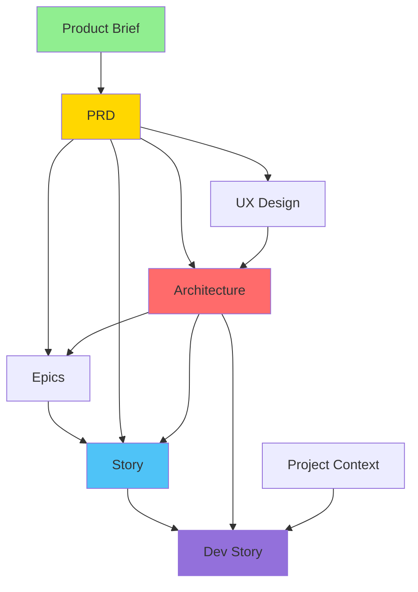

# Context Cascade Documentation

**Version:** 1.0.0
**Last Updated:** 2026-02-09
**Status:** Stable

---

## Overview

Context Cascade is ASMO's mechanism for managing dependencies between workflow phases. It ensures that each workflow has access to the outputs (documents) from workflows it depends on, enabling smooth transitions through the SDLC.

### Key Concepts

- **Document:** An artifact produced by a workflow (PRD, architecture design, story, etc.)
- **Context:** A collection of documents available to a workflow
- **Dependency:** A relationship where workflow B requires document from workflow A
- **Cascade:** The flow of context through dependent workflows

---

## Architecture

### Components

```
┌─────────────────────┐
│  ContextCascade     │ ← Main orchestrator
│  - loadContext()    │
│  - getDependencies()│
└──────────┬──────────┘
           │
           ├──────────────────────┐
           ↓                      ↓
┌──────────────────┐   ┌─────────────────────┐
│ DocumentRegistry │   │ DEFAULT_CONTEXT_    │
│ - getDocument()  │   │ DEPENDENCIES        │
│ - registerDoc()  │   │ (workflow → docs)   │
└──────────────────┘   └─────────────────────┘
```

### Workflow Dependencies Graph



---

## Default Dependencies

### Planning Phase

| Workflow | Requires | Description |
|----------|----------|-------------|
| `create-prd` | `product-brief` | PRD needs strategic vision from brief |
| `create-architecture` | `prd`, `ux-design` | Architecture aligns with requirements and UX |
| `create-ux-design` | `prd` | UX designs based on requirements |
| `create-epics` | `prd`, `architecture` | Epics break down PRD with architectural guidance |
| `create-story` | `epics`, `prd`, `architecture` | Stories derive from epics with full context |

### Implementation Phase

| Workflow | Requires | Description |
|----------|----------|-------------|
| `dev-story` | `story`, `architecture`, `project-context` | Implementation needs story spec + technical context |
| `code-review` | `story`, `architecture` | Review against story acceptance criteria + architecture |

### Quality Phase

| Workflow | Requires | Description |
|----------|----------|-------------|
| `comprehensive-testing` | `story`, `architecture`, `test-strategy` | Tests aligned with strategy and requirements |
| `security-audit` | `architecture`, `project-context` | Security review of architectural decisions |

### TEA Workflows

| Workflow | Requires | Description |
|----------|----------|-------------|
| `tea-test-strategy` | `prd`, `architecture`, `epics` | Strategy based on requirements and design |
| `tea-test-design` | `test-strategy`, `story` | Test cases from strategy + story details |
| `tea-release-readiness` | `test-strategy`, `architecture`, `epics` | Validate against test coverage and architecture |

---

## Usage Examples

### Example 1: Basic Context Loading

```typescript
import { ContextCascade } from '@asmo/core'

// Initialize
const cascade = new ContextCascade({
  outputDir: '_asmo-output'
})

// Load context for create-architecture workflow
const result = await cascade.loadContextForWorkflow('create-architecture')

console.log(result.loaded)   // ['prd', 'ux-design']
console.log(result.missing)  // []
console.log(result.satisfied) // true

// Access loaded documents
const prd = result.context.prd
const uxDesign = result.context.uxDesign
```

### Example 2: Check Missing Dependencies

```typescript
// Before executing a workflow, check if all dependencies are satisfied
const missing = await cascade.getMissingDependencies('dev-story')

if (missing.length > 0) {
  console.log(`⚠️  Missing required context: ${missing.join(', ')}`)
  console.log('Please run the following workflows first:')

  for (const docType of missing) {
    const workflow = `create-${docType}`
    console.log(`  - asmo workflow ${workflow}`)
  }

  process.exit(1)
}

// Safe to proceed
console.log('✅ All dependencies satisfied')
```

### Example 3: Custom Dependencies

```typescript
// Define custom dependencies for your workflow
cascade.setDependencies('custom-integration', [
  'api-spec',
  'data-model',
  'architecture'
])

// Load context
const context = await cascade.loadContextForWorkflow('custom-integration')
```

### Example 4: Build Full Context Chain

```typescript
// Get all documents needed (including transitive dependencies)
const chain = cascade.buildContextChain('dev-story')
console.log(chain)
// ['story', 'architecture', 'project-context', 'epics', 'prd', 'product-brief', 'ux-design']

// This recursively resolves:
// dev-story → story (which needs epics, prd, architecture)
//          → architecture (which needs prd, ux-design)
//          → project-context
```

### Example 5: Format Context for Agent

```typescript
const result = await cascade.loadContextForWorkflow('create-architecture')

// Format for LLM prompt
const formatted = cascade.formatContextForAgent(result.context)
console.log(formatted)
/*
## Prd

# Product Requirements Document
...

---

## Ux Design

# UX Design Specification
...
*/
```

---

## Integration with WorkflowEngine

Context Cascade is automatically used by WorkflowEngine:

```typescript
import { WorkflowEngine } from '@asmo/core'

const engine = WorkflowEngine.create()

// WorkflowEngine automatically:
// 1. Checks context dependencies via ContextCascade
// 2. Loads required documents
// 3. Passes context to agents
// 4. Registers output documents back to DocumentRegistry

await engine.execute('create-architecture', {
  task: 'Design system architecture'
})
```

### Behind the Scenes

```typescript
// Simplified view of WorkflowEngine internals
class WorkflowEngine {
  async execute(workflowId: string, options: any) {
    // 1. Load context
    const contextResult = await this.contextCascade.loadContextForWorkflow(workflowId)

    // 2. Check dependencies
    if (!contextResult.satisfied) {
      throw new Error(`Missing required context: ${contextResult.missing.join(', ')}`)
    }

    // 3. Execute workflow with context
    const result = await this.executeWorkflow(workflowId, {
      ...options,
      context: contextResult.context
    })

    // 4. Register output document
    if (result.document) {
      await this.documentRegistry.registerDocument(
        workflowId.replace('create-', ''),
        result.document.content,
        result.document.metadata
      )
    }

    return result
  }
}
```

---

## Document Types

All supported document types:

```typescript
type DocumentType =
  | 'product-brief'      // Strategic vision and goals
  | 'prd'                // Product Requirements Document
  | 'architecture'       // System architecture design
  | 'ux-design'          // UX specifications and wireframes
  | 'epics'              // Feature epics
  | 'story'              // User stories
  | 'project-context'    // Current project state
  | 'test-strategy'      // TEA test strategy
  | 'release-notes'      // Version release documentation
  | 'api-spec'           // API specification (OpenAPI, etc.)
  | 'data-model'         // Database schema and data models
  | string               // Custom types supported
```

---

## Partial Context (Advanced)

Sometimes you want to proceed with partial context:

```typescript
const result = await cascade.loadContextForWorkflow('create-architecture')

if (!result.satisfied) {
  console.log(`⚠️  Missing: ${result.missing.join(', ')}`)
  console.log('Proceeding with partial context...')

  // Access available context
  const prd = result.context.prd
  if (prd) {
    // Use PRD even if UX design is missing
    console.log('Using PRD:', prd.metadata.title)
  }
}
```

---

## Troubleshooting

### Issue 1: Missing Dependencies Error

**Problem:**
```
Error: Missing required context: prd, ux-design
```

**Solution:**
```bash
# Check which workflows produce these documents
# 'prd' is created by 'create-prd' workflow
asmo workflow create-prd

# 'ux-design' is created by 'create-ux-design' workflow
asmo workflow create-ux-design

# Now you can run your workflow
asmo workflow create-architecture
```

### Issue 2: Document Not Found After Workflow

**Problem:**
```typescript
const result = await cascade.loadContextForWorkflow('dev-story')
// result.missing includes 'story' even though you just ran create-story
```

**Solution:**
Check document registry output directory:
```bash
# Default location
ls -la _asmo-output/

# Check if story.md exists
cat _asmo-output/story.md

# If missing, workflow may have failed to register document
# Check workflow logs for document registration errors
```

### Issue 3: Circular Dependencies

**Problem:**
```
Error: Maximum call stack size exceeded (circular dependency)
```

**Solution:**
Context Cascade uses `visited` set in `buildContextChain()` to prevent cycles.
If you see this error, you have a custom dependency that creates a cycle:

```typescript
// BAD: Circular dependency
cascade.setDependencies('workflow-a', ['document-b'])
cascade.setDependencies('create-document-b', ['document-a'])
// workflow-a → document-b → create-document-b → document-a → create-document-a → ...

// GOOD: Linear dependency
cascade.setDependencies('workflow-a', ['document-b'])
cascade.setDependencies('create-document-b', ['document-c'])
```

### Issue 4: Stale Context

**Problem:**
```
Updated PRD, but create-architecture still uses old version
```

**Solution:**
```bash
# Document registry caches documents
# To force refresh, delete and re-create:
rm _asmo-output/prd.md

# Re-run PRD creation
asmo workflow create-prd

# Now architecture will use new version
asmo workflow create-architecture
```

---

## Best Practices

### 1. ✅ Verify Dependencies Before Execution

```typescript
async function runWorkflowSafely(workflowId: string) {
  const cascade = new ContextCascade()

  // Check first
  const hasContext = await cascade.hasRequiredContext(workflowId)

  if (!hasContext) {
    const missing = await cascade.getMissingDependencies(workflowId)
    throw new Error(`Missing dependencies: ${missing.join(', ')}`)
  }

  // Safe to proceed
  const engine = WorkflowEngine.create()
  return engine.execute(workflowId)
}
```

### 2. ✅ Use Meaningful Document Titles

```typescript
await documentRegistry.registerDocument('prd', content, {
  version: '1.0',
  title: 'User Authentication System - PRD',  // ✅ Descriptive
  createdBy: 'product-owner-agent'
})

// NOT:
await documentRegistry.registerDocument('prd', content, {
  title: 'PRD'  // ❌ Too generic
})
```

### 3. ✅ Log Context Summary

```typescript
const result = await cascade.loadContextForWorkflow('dev-story')
console.log(cascade.summarizeContext(result))
/*
Context Load Summary:
  Loaded: 3 documents
  Missing: 0 documents
  Satisfied: Yes
  Loaded types: story, architecture, project-context
*/
```

### 4. ✅ Handle Partial Context Gracefully

```typescript
const result = await cascade.loadContextForWorkflow('custom-workflow')

// Don't fail immediately if context is missing
if (result.context.architecture) {
  // Use architecture if available
  agent.addContext('architecture', result.context.architecture)
}

if (result.context.testStrategy) {
  // Optional: enhance with test strategy
  agent.addContext('test-strategy', result.context.testStrategy)
}
```

### 5. ❌ Don't Modify Context Cascade During Workflow

```typescript
// BAD: Modifying dependencies mid-workflow can cause inconsistencies
const cascade = new ContextCascade()
const result1 = await cascade.loadContextForWorkflow('workflow-a')

cascade.setDependencies('workflow-a', ['different-deps'])  // ❌ Don't do this

const result2 = await cascade.loadContextForWorkflow('workflow-a')
// Now you have inconsistent state!
```

---

## API Reference

### ContextCascade Methods

#### `loadContextForWorkflow(workflowId: string): Promise<ContextLoadResult>`
Load all documents required by a workflow.

#### `loadContext(documentTypes: DocumentType[]): Promise<ContextLoadResult>`
Load specific documents.

#### `getDependencies(workflowId: string): DocumentType[]`
Get list of dependencies for a workflow.

#### `hasRequiredContext(workflowId: string): Promise<boolean>`
Check if all dependencies are satisfied.

#### `getMissingDependencies(workflowId: string): Promise<DocumentType[]>`
Get list of missing dependencies.

#### `setDependencies(workflowId: string, dependencies: DocumentType[]): void`
Define or update dependencies for a workflow.

#### `buildContextChain(workflowId: string): DocumentType[]`
Recursively resolve all transitive dependencies.

#### `formatContextForAgent(context: CascadedContext): string`
Format context for LLM prompt.

#### `summarizeContext(result: ContextLoadResult): string`
Create human-readable summary.

---

## Testing

### Unit Tests

```typescript
describe('ContextCascade', () => {
  let cascade: ContextCascade

  beforeEach(() => {
    cascade = new ContextCascade({ outputDir: 'test-output' })
  })

  it('should load context for create-architecture', async () => {
    // Mock documents in registry
    const result = await cascade.loadContextForWorkflow('create-architecture')

    expect(result.loaded).toContain('prd')
    expect(result.loaded).toContain('ux-design')
    expect(result.satisfied).toBe(true)
  })

  it('should detect missing dependencies', async () => {
    const missing = await cascade.getMissingDependencies('dev-story')
    expect(missing).toEqual(['story', 'architecture', 'project-context'])
  })
})
```

---

## Migration Guide

### From Manual Context Management

**Before:**
```typescript
// Manual approach
const prdContent = await fs.readFile('docs/prd.md', 'utf-8')
const archContent = await fs.readFile('docs/architecture.md', 'utf-8')

await agent.execute({
  task: 'Implement feature',
  context: {
    prd: prdContent,
    architecture: archContent
  }
})
```

**After:**
```typescript
// Context Cascade approach
const cascade = new ContextCascade()
const result = await cascade.loadContextForWorkflow('dev-story')

await agent.execute({
  task: 'Implement feature',
  context: result.context
})
```

---

## Future Enhancements

- [ ] Context versioning (track document versions in cascade)
- [ ] Context diffs (show what changed between versions)
- [ ] Context validation (JSON Schema for document content)
- [ ] Context compression (summarize large documents for LLM token limits)
- [ ] Context caching (in-memory cache for frequently accessed documents)

---

## Related Documentation

- [Document Registry API](./document-registry.md)
- [Workflow Engine](./workflow-engine.md)
- [BMAD Methodology](../../docs/bmad-methodology.md)

---

**Questions?** See [Troubleshooting](#troubleshooting) or file an issue.
